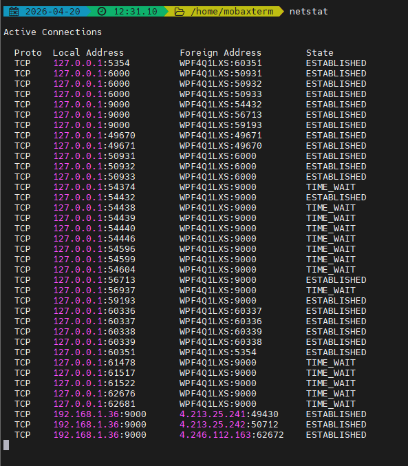

# 🌐 Networking Notes

## 🖥️ Basics

### Network
A **network** is a collection of computers connected to each other to share resources and data.

### Internet
The **Internet** is a collection of interconnected computer networks.

### Protocol
A **protocol** is a standardized set of rules that define how devices format, transmit, and receive data — acting as a common language for communication.

### WWW (World Wide Web)
The **World Wide Web (WWW)** is a global collection of documents and other resources, linked by hyperlinks and URIs.

### Internet Society (ISOC)
The **Internet Society (ISOC)**, founded in 1992, is dedicated to keeping the Internet open, transparent, and user-defined.

---

## 🧩 Simple Client-Server Model
A **client** (like a browser or app) sends a request to a **server**, which processes it and sends a response back.


---

## 📡 Network Protocols

### TCP (Transmission Control Protocol)
Used for **reliable** and **ordered** delivery (e.g., web browsing, emails, file transfers).  
Ensures no data loss.

#### TCP Flags
- SYN → Start connection
- ACK → Acknowledgement (almost always set after handshake)
- FIN (Finish) → Graceful connection termination
- RST (Reset) → Abrupt termination (port is unavailable, unexpected packet etc.)
- PSH (Push) → Don’t buffer — deliver to application immediately
- URG (Urgent) → Marks urgent data (rarely used today)

#### TCP Connection Lifecycle
Key states:
- LISTEN
- SYN_SENT
- SYN_RECEIVED
- ESTABLISHED
- FIN_WAIT_1
- FIN_WAIT_2
- CLOSE_WAIT
- TIME_WAIT
- CLOSED

**CLOSE_WAIT**  
Remote closed connection (sent FIN)  
Your app hasn’t closed yet  

**TIME_WAIT**  
Happens after active close  
Lasts: 2 × MSL (Maximum Segment Lifetime) (~1–4 mins)  

TIME_WAIT exists to ensure reliable connection termination by allowing retransmission of the final ACK and preventing delayed duplicate packets from affecting new connections.

In high-traffic systems, it becomes dangerous because a large number of connections enter TIME_WAIT, leading to ephemeral port exhaustion, increased memory usage, and potential connection failures.  
Mitigation strategies:  
- Enable keep-alive
- Increase ephemeral port range
- Reduce TIME_WAIT timeout (carefully)
- Use connection pooling
- Use load balancers efficiently

**Retransmission & Timeout**
TCP guarantees reliability:  
How?  
- Uses sequence numbers + ACKs  

If ACK not received:  
- Packet retransmitted

Timeout:  
- Based on RTT (Round Trip Time)

**Sliding Window**  
Sliding window ensures efficient data transfer by controlling how much unacknowledged data can be in transit.

**Congestion Control**  
TCP congestion control dynamically adjusts sending rate based on perceived network congestion using packet loss and RTT signals.


### UDP (User Datagram Protocol)
Used for **speed-critical**, real-time apps (e.g., gaming, streaming, video calls).  
Faster but **unreliable**.

### HTTP / HTTPS
- **HTTP**: Used for transferring non-sensitive web content.  
- **HTTPS**: Secure version (uses SSL/TLS).  

Used for web communication between browsers and servers.

#### HTTP Methods : GET POST PUT PATCH DELETE
- GET, PUT, DELETE are idempotent. POST is not.

#### HTTP Status Code
- ✅ 200 (Success)
- 🔁 301 (Permanent Redirect)
- ❌ 400 (Client Error)
- 💥 500 (Server Error)  

4xx = client fault, 5xx = server fault

#### Keep-Alive vs Short Connections
❌ Short Connection (HTTP/1.0 style)
- One request → one TCP connection
- Very expensive

✅ Keep-Alive (HTTP/1.1 default)
- Reuses TCP connection
- Multiple requests over same connection
- Reduces:
    - TCP handshakes
    - Latency
    - TIME_WAIT explosion

#### REST vs RPC
- REST is resource-oriented and leverages HTTP semantics, while RPC is action-oriented and treats APIs like function calls.


---

## 🌍 ISP (Internet Service Provider)
An **ISP** connects users to the internet.  
Your device connects → ISP → Internet backbone → Data travels → Response returns via the **last mile** (ISP to your home).


### NAT (Network Address Translation)
- Allows multiple devices on a private network to share a single public IP address.  
- Adds a layer of security and conserves IPv4 addresses.  


---

## 🧠 IP & Ports

- **IP Address** → Identifies the device.  
- **Port Number** → Identifies the application.  
- Total Ports: `2^16 ≈ 65,535`.

### Common Ports
| Service | Port |
|----------|------|
| FTP | 20/21 |
| SSH | 22 |
| HTTP | 80 |
| HTTPS | 443 |
| Jenkins/Web Apps | 8080 / 8443 |
| Docker | 2375 / 2376 |
| K8s API | 6443 |
| Prometheus | 9090 |
| Elasticsearch | 9200 |
| Kibana | 5601 |
| MySQL | 3306 |
| PostgreSQL | 5432 |

---

## 🕸️ Types of Networks

| Type | Description |
|------|--------------|
| **LAN** | Connects devices within a limited area (home/office). |
| **MAN** | Connects multiple LANs within a city/metropolitan area. |
| **WAN** | Connects networks over large geographic areas. |

---

## ⚙️ Devices

### Modem
Converts **digital** signals to **analog** (and vice versa) to connect local networks to the internet.

### Router
Connects multiple devices to the same network and routes data between them and the internet.

---

## 🧱 Network Topologies
- **Bus**
- **Ring**
- **Star**
- **Tree**
- **Mesh**

---

# 🧬 OSI Model (7 Layers)

Sending a WhatsApp message “Hey!” from India to the US:

| Layer | Name | Function | Data Unit | Example Protocols |
|-------|------|-----------|------------|--------------------|
| 7 | **Application** | Message creation (WhatsApp App, HTTPS) | Message data | HTTPS, WebSocket |
| 6 | **Presentation** | Encryption & compression | Encrypted blob | AES, Curve25519 |
| 5 | **Session** | Maintains persistent connection | Session stream | TLS, WebSocket |
| 4 | **Transport** | Reliable delivery, segmentation | TCP segments | TCP, UDP |
| 3 | **Network** | Routing and addressing | Packets | IP, NAT, ICMP |
| 2 | **Data Link** | Framing, error detection | Frames | Wi-Fi, Ethernet |
| 1 | **Physical** | Bit transmission | Bits | Fiber, Wi-Fi |

### Example:
Your phone → Router → Internet → WhatsApp Server → Friend’s phone  
Each layer adds its own header (encapsulation).  
On receiving, the reverse happens (de-encapsulation).

---

## 🔒 End-to-End Example Summary
| Component | Layer | Technology |
|------------|--------|------------|
| Encryption | 6/7 | Signal Protocol |
| Reliable Transfer | 4 | TCP |
| Routing | 3 | IP, BGP |
| Local Transmission | 2 | Wi-Fi, LTE |
| Physical Medium | 1 | Fiber, 4G/5G |

---

## ⚙️ TCP/IP Model
Simplified version of OSI with **5 layers** — combines application, presentation, and session into one.

---

## 🧩 MAC Address
A **MAC address** is a unique hardware ID assigned to a network card (Layer 2).  
Used by **switches** to forward frames in a local network.

---


## 🍪 Cookies
A **cookie** is a small piece of data stored by the browser when you first log in — used for session management.

---

## 🌍 DNS (Domain Name System)
A **distributed database** that resolves domain names to IP addresses.  
Lookup order:
1. Local DNS cache  
2. ISP DNS  
3. Root / Authoritative DNS  

### Recursive vs Iterative DNS Queries
✅ Recursive Query: Give me the final answer. I don’t care how.  
```text
Client → DNS Resolver → (does all work) → returns final IP
```

✅ Iterative Query (Resolver ↔ DNS hierarchy): I’ll ask step by step.  
```text
Resolver → Root → TLD → Authoritative
```
Each server replies:  
`“I don’t know, but ask this server”`

### DNS Record Types
**A Record**  
Maps domain → IPv4  
`example.com → 192.168.1.1`  

**AAAA Record**  
Maps domain → IPv6  

**CNAME (Alias)**  
`api.example.com → example.com`  
Points to another domain  
NOT directly to IP  

**TTL**
- Time (in seconds) a DNS response is cached
- Example: `TTL = 300 → cache for 5 minutes`
- High TTL
    - Faster (less DNS queries)
    - BUT slow updates

TTL controls how long DNS records are cached, balancing performance and propagation speed.

*Why DNS changes are not reflecting?*
DNS changes don’t reflect immediately due to TTL-based caching across multiple layers like browser, OS, ISP, and CDN. Until the cached entries expire, users may continue to see old IPs. Proper TTL planning and cache invalidation strategies are critical during DNS changes.

---

## 🤝 TCP 3-Way Handshake

| Step | Direction | Purpose | TCP State |
|------|------------|----------|------------|
| 1. SYN | Client → Server | Initiate connection | SYN_SENT |
| 2. SYN-ACK | Server → Client | Acknowledge request | SYN_RECEIVED |
| 3. ACK | Client → Server | Confirm connection | ESTABLISHED |

**Analogy:**  
You: “Hello?” → Friend: “Hey, can you hear me?” → You: “Yes, loud and clear!” → Start chatting 🎉

---

## 🔁 Data Representation at Layers
- Layer 1 → **Bits**
- Layer 2 → **Frames**
- Layer 3 → **Packets**
- Layer 4 → **Segments**
- Layer 5–7 → **Data / Messages**


---

## 🧭 Loopback Address

| Version | Address | Range | Description |
|----------|----------|--------|-------------|
| IPv4 | 127.0.0.1 | 127.0.0.0/8 | Localhost |
| IPv6 | ::1 | ::1/128 | IPv6 localhost |

**Usage:**  
Used to test network functionality within your own computer (packets never leave the device).

🧠 How It Works
When you send a packet to the loopback address (127.0.0.1):  
• The packet never leaves your computer.  
• It is handled entirely by the operating system’s network stack.  
This helps you test local network functionality (like sockets, web servers, APIs) without needing an external network or internet.

**Interview Tip:**  
> A loopback address (127.0.0.1) routes traffic internally to test local network functionality.

---

✅ **In Short:**
When you send a WhatsApp message:
1. App encrypts and prepares data (Application layer).
2. Layers add addressing, routing, and framing info.
3. Data travels through routers and ISPs to the destination.
4. Receiver’s device reverses the process and decrypts the message.

---

📘 **Summary Table**

| Concept | Layer | Function |
|----------|--------|-----------|
| Encryption | 6/7 | Data security |
| Reliability | 4 | TCP delivery |
| Routing | 3 | IP addressing |
| Transmission | 2 | Frames |
| Signal | 1 | Bits |

---


Private IP address range -  


## Debugging 
1. API slowness debugging -  

| Step | Layer        | What to Check      | Command                                                                                                        | What to Look For          | Possible Issue            |
| ---- | ------------ | ------------------ | -------------------------------------------------------------------------------------------------------------- | ------------------------- | ------------------------- |
| 1    | Client       | Response breakdown | `curl -w "%{time_namelookup} %{time_connect} %{time_starttransfer} %{time_total}" -o /dev/null -s https://api` | High DNS / Connect / TTFB | Identify bottleneck layer |
| 2    | DNS          | Domain resolution  | `nslookup api` / `dig api`                                                                                     | Slow or wrong IP          | DNS issue / caching       |
| 3    | Network      | Latency            | `ping api`                                                                                                     | High ms / packet loss     | Network slowness          |
| 4    | Network Path | Route hops         | `traceroute api`                                                                                               | Delay at specific hop     | Routing issue             |
| 5    | Connectivity | Port access        | `telnet api 443` / `nc -vz api 443`                                                                            | Timeout / refused         | Firewall / SG issue       |
| 6    | HTTP         | Request/response   | `curl -v https://api`                                                                                          | Delay before response     | Server processing slow    |
| 7    | TLS          | Handshake          | `curl -v https://api`                                                                                          | Delay in SSL handshake    | Certificate / TLS issue   |
| 8    | Server       | CPU usage          | `top` / `htop`                                                                                                 | CPU ~100%                 | App overload              |
| 9    | Server       | Memory usage       | `free -m` / `vmstat 1`                                                                                         | High swap / low free mem  | Memory pressure           |
| 10   | Server       | Disk I/O           | `iostat -x 1`                                                                                                  | High wait / %util         | Disk bottleneck           |
| 11   | App          | Logs               | `tail -f app.log`                                                                                              | Errors / slow queries     | App / DB issue            |
| 12   | OS           | Connections        | `ss -s` / `ss -lntp`                                                                                           | Too many connections      | Connection exhaustion     |
| 13   | Process      | Resource hogs      | `ps aux --sort=-%cpu`                                                                                          | High CPU process          | Misbehaving service       |
| 14   | Deep Debug   | Syscalls           | `strace -p <PID>`                                                                                              | Blocking calls            | I/O or dependency issue   |
| 15   | Network Deep | Packets            | `tcpdump -i any host api`                                                                                      | Retransmissions           | Network drops             |


2. How to check port connectivity?  
- Using telnet - `telnet host port` eg. `telnet google.com 443`
- Using curl - `curl -v https://host`
    - DNS resolution
    - P connection
    - TLS handshake
    - HTTP response
- Check if port is listening: `ss -lnt | grep 8080`


**If port is listed → Service is running**

- Using ping (Only checks host reachability): `ping host` 

3. How to trace network latency  
- Start with ping - `ping google.com`
- Use traceroute - `traceroute google.com`
- Use mtr (ping + traceroute) - `mtr google.com`


## Load Balancing & Reverse Proxy
- Load Balancing distributes incoming traffic across multiple servers to improve availability, scalability, and reliability.
```text
Client → Load Balancer → Multiple backend servers
```

### L4 vs L7 Load Balancer  
⚙️ L4 (Layer 4 – Transport)  
- Works at TCP/UDP level
- Doesn’t understand HTTP
- Routes based on:  
    - IP  
    - Port  
    - Example: AWS NLB   

🌐 L7 (Layer 7 – Application)  
- Understands HTTP/HTTPS
- Can inspect:
    - URL path
    - Headers
    - Cookies
    - Example: NGINX

### Load Balancing Algorithms
1. Round Robin  
Requests distributed sequentially
```text
Req1 → Server1  
Req2 → Server2  
Req3 → Server3
```
✅ Simple  
❌ Doesn’t consider load  
2. Least Connections:    
Sends traffic to server with fewest active connections


### Forwards proxy vs Reverse Proxy vs Load balancer


**Forward Proxy (Client-side proxy)** - A proxy that sits between client and internet
```text
Client → Forward Proxy → Internet (Servers)
```

**Reverse Proxy (Server-side proxy)** - A proxy that sits in front of backend servers
```text
Client → Reverse Proxy → Backend Servers
```

**Load Balancer** - Distributes traffic across multiple backend servers
```text
Client → Load Balancer → Multiple Servers
```

Forward proxy → client side  
Reverse proxy → server side  
Load balancer → distribution logic  

**SSL Termination**
- Decrypting HTTPS traffic at the proxy/load balancer instead of backend servers.
```text
Client (HTTPS)
   ↓
Load Balancer / Reverse Proxy (SSL termination)
   ↓
Backend (HTTP)
```
- What happens:
1. Client sends encrypted request
2. LB/Proxy decrypts it
3. Sends plain HTTP to backend

SSL termination offloads encryption and decryption from backend services to a load balancer or reverse proxy, improving performance and simplifying certificate management.


❓ Difference between forward proxy, reverse proxy, load balancer?  
A forward proxy sits on the client side and controls outbound requests, while a reverse proxy sits on the server side and forwards incoming requests to backend services. A load balancer focuses on distributing traffic across multiple servers for scalability and availability. In modern systems, reverse proxies like NGINX often also perform load balancing.

❓ What is SSL termination?  
SSL termination is the process where a load balancer or reverse proxy handles HTTPS decryption, reducing the load on backend services and centralizing certificate management.

- “In Kubernetes, Ingress controllers (like NGINX) act as reverse proxies and perform SSL termination.”
- “Cloud load balancers (like ALB) handle SSL termination at edge.”
- “Avoid plaintext backend traffic in zero-trust environments → use mTLS”


❓ How HTTPS secures communication?  

HTTPS secures communication using TLS, which combines asymmetric and symmetric cryptography. During the TLS handshake, the client verifies the server’s certificate issued by a trusted Certificate Authority, ensuring authenticity. A session key is then securely exchanged using public-key cryptography, and all subsequent communication is encrypted using symmetric encryption, ensuring confidentiality and integrity.


❓ What is self-signed cert?  
Not trusted by CA → browser shows warning

❓ What HTTPS really is?  
HTTPS = HTTP + TLS (Transport Layer Security)


**Public–Private Key Basics**
Every server has:
- Private key → secret (never shared)
- Public key → shared with clients
- How they work:
    - Data encrypted with public key → only private key can decrypt
    - Data signed with private key → verified using public key
- Encrypt with Public Key → Decrypt with Private Key


❓ WHY UDP is faster?  
UDP is faster because it is connectionless and does not implement reliability, ordering, or congestion control mechanisms like TCP. This reduces overhead and latency, allowing data to be sent immediately. However, this comes at the cost of reliability, which must be handled at the application level if needed. DNS uses UDP for speed but falls back to TCP if needed

❓ How does a machine find MAC address from IP?
A machine uses ARP (Address Resolution Protocol) to map an IP address to a MAC address. It first checks its ARP cache, and if no entry exists, it broadcasts an ARP request on the local network. The device with the matching IP responds with its MAC address, which is then cached and used for communication. If the destination is outside the local network, ARP is used to resolve the MAC address of the default gateway instead of the final destination. *Kubernetes uses ARP at node-level networking.*


**Connection pooling:**  
- Reusing connections reduces latency
- Prevents TIME_WAIT explosion

**Ephemeral ports:**  
- Temporary ports used by client
- Range: ~32768–60999 (Linux)


**Scenario: API works locally but not on server**
- Check binding (localhost vs 0.0.0.0)
- Check firewall
- Check port listening

**Scenario: API slow only for some users**
- DNS issue
- Geo latency
- CDN issue

**Scenario: API works with curl but not in browser**
- First conclusion 
    - Backend is likely working
    - Issue is in client behavior, browser rules, or headers
- CORS issue
- SSL issue
- Header mismatch


**When client hits https://api.example.com:**  
1. DNS resolves domain → IP
2. TCP handshake established
3. TLS handshake happens
4. HTTP request sent
5. Load balancer routes request
6. Backend processes request
7. Response returned


**ICMP (Internet Control Message Protocol):**  
- Used for diagnostics and error reporting
- ping uses ICMP echo request/reply