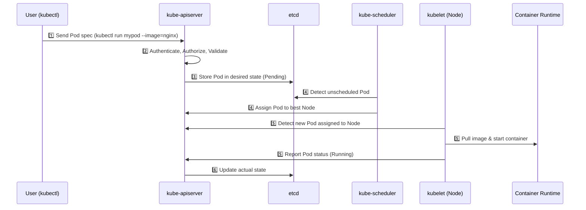
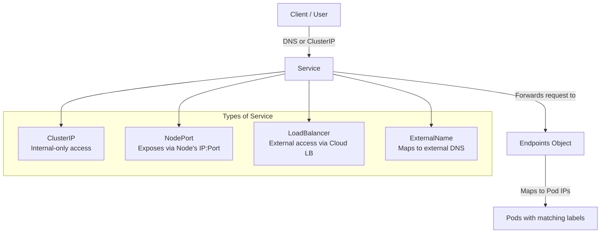

# ☸️ Kubernetes Notes

---

## 🚀 Why Kubernetes?

### 🧩 The Problem Before Kubernetes
Before Kubernetes (a.k.a. K8s), deploying and managing containerized applications at scale was **painful**:

| Challenge | Description |
|------------|--------------|
| **Manual Deployment** | You had to manually start containers on each host. |
| **Scaling Issues** | Scaling up/down required manual container orchestration. |
| **Downtime** | If a container or node crashed, services went down. |
| **Networking Hell** | Managing communication between containers and hosts was complex. |
| **Load Balancing** | No built-in mechanism to distribute traffic among containers. |
| **Resource Management** | Containers could fight for CPU/RAM — no isolation or limits. |

---

### 💡 Kubernetes to the Rescue
Kubernetes (by Google, now CNCF) automates deployment, scaling, and management of containerized applications.

| Feature | What It Does |
|----------|---------------|
| **Container Orchestration** | Manages container lifecycle — deploy, start, stop, restart. |
| **Self-Healing** | Restarts failed containers automatically. |
| **Load Balancing & Service Discovery** | Distributes traffic evenly across healthy pods. |
| **Horizontal Scaling** | Scales pods up/down automatically based on resource usage. |
| **Rolling Updates & Rollbacks** | Updates apps with zero downtime. |
| **Declarative Configuration** | You describe the desired state — Kubernetes makes it real. |
| **Secret & Config Management** | Securely manages environment variables, config, and credentials. |

> 🧠 Think of Kubernetes as the **"operating system for your containers"** — it abstracts away servers and lets you focus on apps.

---

## 🏗️ Kubernetes Architecture Overview

### 🎯 Core Idea
Kubernetes follows a **Master–Worker (Control Plane–Node)** architecture.

---

### 🧠 Control Plane Components (Master Node)
The **Control Plane** manages the cluster — it makes global decisions like scheduling, scaling, and maintaining the desired state.

| Component | Role |
|------------|------|
| **kube-apiserver** | The **entry point** for all commands (kubectl, UI, API calls). Exposes REST APIs for cluster communication. |
| **etcd** | The **key-value database** that stores the cluster’s state and configuration. (Think of it as Kubernetes’ brain 🧠). |
| **kube-scheduler** | Decides **which node** a new pod should run on based on CPU, memory, affinity, taints, etc. |
| **kube-controller-manager** | Runs various **controllers** (like replication, node, endpoint, etc.) that maintain cluster health. |
| **cloud-controller-manager** | Integrates Kubernetes with cloud providers (e.g., AWS, GCP, Azure) for load balancers, volumes, etc. |

> Example: You declare 3 replicas of your app. The controller ensures exactly 3 pods are always running — not more, not less.

---

### ⚙️ Worker Node Components
Worker nodes actually **run your application workloads** (pods, containers).

| Component | Role |
|------------|------|
| **kubelet** | Agent running on each node. Talks to the API server and ensures containers are running as per PodSpec. |
| **kube-proxy** | Manages **networking** for pods — handles routing and load balancing inside the cluster. |
| **Container Runtime** | Responsible for running containers (e.g., containerd, CRI-O, Docker). |

> 🧠 kubelet = caretaker of the node.  
> kube-proxy = network traffic manager.

---

### 🔗 How They Talk (Cluster Flow)


# 🧠 What Happens When You Run `kubectl run mypod --image=nginx`
---
## ⚙️ Step-by-Step Internal Flow
### 🟢 1. kubectl Command
- You run:
  ```bash
  kubectl run mypod --image=nginx
  ```
- The kubectl CLI parses your command and constructs a Pod manifest (YAML) on your behalf.
- It then sends a REST API request to the kube-apiserver, typically over HTTPS.

### 🧩 2. API Server (Authentication & Validation)
The kube-apiserver is the entry point for all cluster operations.
It performs:
- **Authentication**: Verifies your identity (e.g., via certificate, token, or kubeconfig context).
- **Authorization**: Checks your access permissions (e.g., via RBAC rules).
- **Admission Control**: Runs admission webhooks or policies that can mutate or deny the request.
- **Schema Validation**: Ensures the Pod manifest follows the correct Kubernetes API spec.
✅ If all checks pass → the request is accepted.

### 💾 3. Persisting to etcd
The API server writes the validated Pod object into etcd, which is Kubernetes’ distributed key-value store holding the cluster’s desired state.
At this point, the Pod exists — but it’s in the Pending state because no node has been assigned yet.


### 🧮 4. Scheduling the Pod
- The kube-scheduler continuously watches the API server (via etcd) for unscheduled Pods.
- When it finds the new Pod:
    - It evaluates all available nodes based on:
        - Resource availability (CPU, memory)
        - Node selectors, affinity/anti-affinity rules
        - Taints and tolerations
        - Pod priorities and topology constraints
    - It selects the most suitable node and updates the Pod’s spec.nodeName field in etcd.
- The Pod now transitions from Pending → Scheduled.

### 🖥️ 5. Kubelet on the Assigned Node
- The kubelet (agent running on every node) watches the API server for Pods scheduled to its node.
- Once it detects the new Pod:
    1. It retrieves the Pod specification.
    2. Pulls the container image (nginx in this case) from the container registry (e.g., Docker Hub), if not already cached.
    3. Creates the Pod and its container(s) via the container runtime (e.g., containerd, CRI-O, or Docker).
    4. Monitors the container, ensuring it stays in the Running and healthy state.
    5. Reports Pod status back to the API server.

### 🧑‍🔧 6. Controller Manager
- The kube-controller-manager runs multiple background controllers that continuously reconcile the desired state (from etcd) with the actual state (from the cluster).
- If a Pod crashes or a node fails, the relevant controller ensures a new Pod is created to restore the desired state.

### 🔁 7. Continuous Reconciliation
- Kubernetes operates on the principle of declarative desired state:
**You declare what you want; Kubernetes ensures how it happens.**
- Controllers, scheduler, and kubelets all work together in a continuous feedback loop to maintain:
    - Pod health
    - Correct node assignments
    - Replica counts
    - Desired configurations

### 🧭 TL;DR (Summary Flow)



# 🧭 Kubernetes Context, Namespace, Cluster & Kubeconfig
---

## ⚙️ The Big Picture

Whenever you run a command like:

```bash
kubectl get pods
```
Your kubectl CLI needs to know 4 things:
| Thing         | Question It Answers                                                 |
| ------------- | ------------------------------------------------------------------- |
| **Cluster**   | “Which Kubernetes API server am I talking to?”                      |
| **User**      | “Who am I? (credentials/cert/key/token)”                            |
| **Namespace** | “Inside which logical space (team/project)?”                        |
| **Context**   | “Which combo of cluster + user + namespace should I use right now?” |

All of these are stored in a single file:
👉 ~/.kube/config (a.k.a. kubeconfig)

## 📁 kubeconfig File Structure
A kubeconfig file typically looks like this:
```yaml
apiVersion: v1
kind: Config
clusters:
  - name: dev-cluster
    cluster:
      server: https://192.168.49.2:8443
      certificate-authority: /home/abhi/.minikube/ca.crt

users:
  - name: dev-user
    user:
      client-certificate: /home/abhi/.minikube/profiles/minikube/client.crt
      client-key: /home/abhi/.minikube/profiles/minikube/client.key

contexts:
  - name: dev-context
    context:
      cluster: dev-cluster
      user: dev-user
      namespace: dev-team

current-context: dev-context
```

🔍 Breakdown
| Section             | Purpose                                                                                          |
| ------------------- | ------------------------------------------------------------------------------------------------ |
| **clusters**        | Defines all known clusters your kubeconfig can connect to. Each has an API server URL & CA cert. |
| **users**           | Authentication info for identities allowed to connect (certs, tokens, etc.)                      |
| **contexts**        | Each context binds a specific **cluster**, **user**, and optional **namespace** together.        |
| **current-context** | The default context used when you run `kubectl` commands.                                        |

## 🧠 What Is a Context?
A context is like a profile in your kubeconfig.

It tells kubectl:
**“Use this cluster, with this user, and this namespace.”**
Example
| Context | Cluster | User | Namespace |
|----------|----------|-------------|
| dev-context | dev-cluster | dev-user | dev-team |
| prod-context | prod-cluster | prod-admin | prod |

## 🧩 Context vs Namespace vs Cluster — Side-by-Side
| Concept       | Description                                                              | Scope                          | Example                          |
| ------------- | ------------------------------------------------------------------------ | ------------------------------ | -------------------------------- |
| **Cluster**   | A physical or virtual Kubernetes environment (API server + etcd + nodes) | Whole Kubernetes installation  | `dev-cluster`, `prod-cluster`    |
| **Namespace** | Logical isolation *inside* a cluster                                     | Subdivision of cluster         | `default`, `dev-team`, `staging` |
| **Context**   | A local kubeconfig entry linking cluster + user + namespace              | Local to your `kubectl` config | `dev-context`, `prod-context`    |

So:
- The cluster lives on your infrastructure.
- The namespace lives inside the cluster.
- The context lives on your machine in kubeconfig.


## 🧭 Commands Cheat Sheet
```bash
kubectl config current-context          # View current context
kubectl config get-contexts             # List all contexts
kubectl config use-context dev-context  # Switch context
kubectl config view                     # View config details
kubectl config set-context --current --namespace=dev-team  # Set namespace for current context
kubectl config view --minify | grep namespace  # Verify current context + namespace
```

## 📊 Example Visualization
```less
Kubeconfig
│
├── Context: dev-context
│     ├── Cluster: dev-cluster (https://192.168.49.2:8443)
│     ├── User: dev-user (certs)
│     └── Namespace: dev-team
│
└── Context: prod-context
      ├── Cluster: prod-cluster (https://prod-api.mycluster.com)
      ├── User: prod-admin (token)
      └── Namespace: prod
```

## 💡 Real-World Analogy
| Term           | Analogy                                                             |
| -------------- | ------------------------------------------------------------------- |
| **Cluster**    | A *building* (where people work)                                    |
| **Namespace**  | A *department* inside the building                                  |
| **User**       | A *person* with an access card                                      |
| **Context**    | The *badge setting* that says which building + department you’re in |
| **kubeconfig** | The *directory of all badges and their permissions*                 |

## 🧩 Pro Tip — Multiple Clusters, One File
You can merge multiple cluster configs into one kubeconfig:
```bash
export KUBECONFIG=~/.kube/config:/path/to/another/config
kubectl config view --merge --flatten > ~/.kube/config
```
This merges everything cleanly, so you can switch between contexts easily.


# 🔐 Kubernetes Authentication & API Server Workflow
---
## 🧭 What Happens When You Run a `kubectl` Command
Let’s take a simple example:
```bash
kubectl get pods
```
Behind the scenes, this innocent-looking command triggers a full-fledged chain of communication between your laptop and the cluster.
## ⚙️ Step-by-Step Workflow
1️⃣ kubectl Reads kubeconfig
Looks for your active context (current-context).
Extracts:
- Cluster endpoint (API server URL)
- Authentication method (user token, certs, etc.)
- Namespace (if specified)

2️⃣ HTTPS Request to API Server
kubectl sends a REST API call (e.g. GET /api/v1/namespaces/default/pods)
The request includes:
  - Bearer token / Client certificate / OIDC token
  - Namespace and resource info
  - Command verb (GET, POST, PATCH, DELETE)

3️⃣ API Server Authentication
The API Server validates who you are.
Supported auth mechanisms:
| Auth Type                       | Description                                                         |
| ------------------------------- | ------------------------------------------------------------------- |
| **Client Certificates**         | Used by `admin` or `kubelet`. Defined under `users:` in kubeconfig. |
| **Bearer Tokens**               | Static or ServiceAccount tokens stored in Secrets.                  |
| **OpenID Connect (OIDC)**       | External identity provider (e.g., Google, Azure AD).                |
| **Webhook Token Authenticator** | Custom external auth service.                                       |
| **Bootstrap Tokens**            | Temporary tokens used for cluster joining.                          |
📘 The API server verifies the token or certificate using its internal auth plugins or external services.

4️⃣ Authorization — “Can You Do It?”
Once authenticated, the API server checks what you’re allowed to do.
Common mechanisms:
| Mode                                      | Description                                                        |
| ----------------------------------------- | ------------------------------------------------------------------ |
| **RBAC (Role-Based Access Control)**      | Grants permissions to users/groups based on Roles or ClusterRoles. |
| **ABAC (Attribute-Based Access Control)** | Legacy, JSON-based access control (rare now).                      |
| **Webhook Authorization**                 | Delegates access decisions to an external service.                 |
| **Node Authorization**                    | Special rules for kubelets.                                        |

Example RBAC check:
Can user dev-user perform list on pods in namespace dev-team?
If yes → continue
If no → 403 Forbidden

5️⃣ Admission Control — “Should We Mutate or Validate It?”
Admission controllers act like gatekeepers:
They can mutate (auto-inject sidecars, labels)
Or validate (reject invalid manifests)
Examples:
| Admission Controller         | Purpose                                           |
| ---------------------------- | ------------------------------------------------- |
| `NamespaceLifecycle`         | Prevents creating resources in deleted namespaces |
| `LimitRanger`                | Enforces CPU/memory limits                        |
| `MutatingAdmissionWebhook`   | Lets you modify objects before storing            |
| `ValidatingAdmissionWebhook` | Lets you validate custom policies                 |

6️⃣ API Server Writes to etcd
If the request is valid and authorized:
The API server serializes the object (e.g. Pod spec)
Stores it in etcd, the cluster’s distributed key-value database
📦 etcd = the source of truth for the entire cluster state.

7️⃣ Controllers React
Controllers continuously watch the API server for changes:
Deployment Controller notices a new Deployment → creates ReplicaSets
ReplicaSet Controller notices missing Pods → creates Pods
Scheduler finds a node → assigns it to the Pod
Kubelet on that node pulls images & starts containers
The loop continues until the desired state = actual state ✅


# ☸️ Kubernetes Core Objects — Pods, ReplicaSets, Deployments & Namespaces
---

## 🧱 1. Namespace

### 💡 What is a Namespace?

- A **Namespace** is a *logical isolation* layer within a Kubernetes cluster.  
- Think of it as a *virtual cluster* inside your physical cluster.
- Namespaces help **organize**, **isolate**, and **control access** to resources.

---

### 🧩 Why Use Namespaces?

| Use Case | Description |
|-----------|--------------|
| Multi-tenant environments | Separate environments for different teams or projects |
| Access control | Apply RBAC permissions per namespace |
| Resource quotas | Limit CPU, memory, and object counts within a namespace |
| Network isolation | Combine with NetworkPolicies to restrict cross-namespace communication |

---

### 🧾 Example: Create a Namespace

```yaml
apiVersion: v1
kind: Namespace
metadata:
  name: dev-team
```
Apply it:
```bash
kubectl apply -f namespace.yaml
```

## 🧩 2. Pod — The Smallest Deployable Unit
🧠 Concept
- A Pod is the basic execution unit in Kubernetes.
- It wraps one or more containers that share:
  - Networking (same IP, ports)
  - Storage volumes
  - Lifecycle
Usually, one Pod = one container, unless you need sidecars (e.g., logging or proxy containers).
Example:
```yaml
apiVersion: v1
kind: Pod
metadata:
  name: nginx-pod
  namespace: dev-team
spec:
  containers:
    - name: nginx
      image: nginx:latest
      ports:
        - containerPort: 80
```


## 🔁 3. ReplicaSet — Ensures Pod Availability
💡 What It Does
- A ReplicaSet (RS) maintains a stable set of Pod replicas at any given time.
- If a Pod crashes or a node fails, the ReplicaSet creates a new one automatically.
However, we rarely create ReplicaSets directly — Deployments manage them for us.
Example:
```yaml
apiVersion: apps/v1
kind: ReplicaSet
metadata:
  name: nginx-rs
  namespace: dev-team
spec:
  replicas: 3
  selector:
    matchLabels:
      app: nginx
  template:
    metadata:
      labels:
        app: nginx
    spec:
      containers:
        - name: nginx
          image: nginx:latest
          ports:
            - containerPort: 80
```


## 🚀 4. Deployment — Declarative Pod Management
💡 Why Deployments?
- A Deployment provides declarative updates for Pods and ReplicaSets.
- It supports:
  - Rolling updates
  - Rollbacks
  - Versioned deployments
It’s the most common way to deploy applications in Kubernetes.
Example:
```yaml
apiVersion: apps/v1
kind: Deployment
metadata:
  name: nginx-deploy
  namespace: dev-team
spec:
  replicas: 3
  selector:
    matchLabels:
      app: nginx
  template:
    metadata:
      labels:
        app: nginx
    spec:
      containers:
        - name: nginx
          image: nginx:1.27
          ports:
            - containerPort: 80
```

Check rollout:
```bash
kubectl get deploy -n dev-team
kubectl rollout status deployment/nginx-deploy -n dev-team
```

Upgrade image:
```bash
kubectl set image deployment/nginx-deploy nginx=nginx:1.28 -n dev-team
```

Rollback:
```bash
kubectl rollout undo deployment/nginx-deploy -n dev-team
```


# 🌐 Kubernetes Service — The Networking Backbone  

When Pods come and go (because of scaling, crashes, or updates), their **IP addresses change dynamically**.  
To make sure clients can still reach your application reliably, **Kubernetes Service** provides a **stable networking endpoint** that routes traffic to the right Pods.

---

## 💡 What is a Service?

> A **Service** is a Kubernetes abstraction that defines a stable, logical set of Pods and a policy by which to access them.

- Provides a **stable DNS name** and **IP address** (called `ClusterIP`)
- Uses **labels & selectors** to automatically discover target Pods
- Handles **load balancing** among Pods

---

## 🧩 Basic Example
Let’s say you deployed 3 replicas of an NGINX Pod:
```yaml
apiVersion: apps/v1
kind: Deployment
metadata:
  name: nginx-deploy
spec:
  replicas: 3
  selector:
    matchLabels:
      app: nginx
  template:
    metadata:
      labels:
        app: nginx
    spec:
      containers:
        - name: nginx
          image: nginx
          ports:
            - containerPort: 80
```
Now, you want to expose these Pods inside the cluster:
```yaml
apiVersion: v1
kind: Service
metadata:
  name: nginx-service
spec:
  selector:
    app: nginx
  ports:
    - protocol: TCP
      port: 80
      targetPort: 80
  type: ClusterIP
```
## 🎯 What happens:
- Service nginx-service gets a fixed ClusterIP (say 10.96.0.12).
- Requests to this IP (or DNS nginx-service.default.svc.cluster.local) will be load balanced across all Pods with label app=nginx.

## ⚙️ How Services Work (Under the Hood)
- Selector — Matches Pods based on labels.
- Endpoints Object — Tracks IPs of the matched Pods.
- kube-proxy — Updates iptables/ipvs rules on each Node to route traffic.
- CoreDNS — Provides a DNS name for every Service.

## 🔗 Kubernetes Endpoints — The Bridge Between Services and Pods
When you create a **Service**, Kubernetes automatically creates a corresponding **Endpoints** object that holds the **IP addresses of the Pods** matching the Service’s selector.

Think of it as the **glue** that connects:
> **Service (stable virtual IP)** → **Pods (real, changing IPs)**
```bash
kubectl get endpoints myapp-svc
```

## 🧱 Types of Services
1️⃣ ClusterIP (default)
- Exposes the Service internally within the cluster.
- Not accessible externally.
- Default service type.
```yaml
type: ClusterIP
```
✅ Use case: Internal microservice communication.

2️⃣ NodePort
- Exposes the Service on each Node’s IP at a static port (30000–32767).
- Automatically creates a ClusterIP behind the scenes.
- Accessible via NodeIP:NodePort.
```yaml
type: NodePort
ports:
  - port: 80
    targetPort: 80
    nodePort: 31080
```
targetPort => PodPort
port => servicePort
nodePort => nodePort

How to access?
curl <pod-ip>:targetPort
curl <service-ip>:port
curl <node-ip.:nodePort

✅ Use case: Accessing apps externally for testing or simple setups.


3️⃣ LoadBalancer
- Exposes the Service externally using a cloud provider’s Load Balancer.
- Automatically provisions an external IP.
- Internally creates both NodePort and ClusterIP services.
```yaml
type: LoadBalancer
ports:
  - port: 80
    targetPort: 80
```
✅ Use case: Publicly accessible apps on managed clusters (EKS, AKS, GKE).


4️⃣ ExternalName
Maps a Service to an external DNS name — no selector, no endpoints.
```yaml
type: ExternalName
externalName: api.externalservice.com
```
✅ Use case: Connect K8s workloads to external APIs or legacy systems.


5️⃣ Headless Service
- Special Service without a ClusterIP (clusterIP: None).
- DNS returns Pod IPs directly.
- No load balancing — client decides.
```yaml
apiVersion: v1
kind: Service
metadata:
  name: mydb
spec:
  clusterIP: None
  selector:
    app: mysql
  ports:
    - port: 3306
```
✅ Use case: StatefulSets (MySQL, Cassandra, etc.)

## 🕸️ Traffic Flow Visualization (Mermaid Diagram)

## Important commands
```bash
# List all services
kubectl get svc

# Describe service in detail
kubectl describe svc nginx-service

# Check which Pods are targeted
kubectl get endpoints nginx-service
```

**Note:** When you define multiple key-value pairs in a Service’s `spec.selector`, **only the Pods matching *all* of those labels** will be linked to that Service.


# 🌀 Rolling Updates in Kubernetes
🎯 Purpose
A Rolling Update ensures zero downtime while updating your application version (for example, updating an image tag or config in a Deployment).
Kubernetes doesn’t kill all Pods at once — instead, it gradually replaces old Pods with new ones while keeping the app available.

## ⚙️ Workflow of Rolling Update
Let’s assume you have a Deployment managing 4 replicas of nginx:1.25, and you update it to nginx:1.26.
```baah
kubectl set image deployment/nginx-deploy nginx=nginx:1.26
```
Now Kubernetes does this behind the scenes:
1️⃣ New ReplicaSet Created
- Old RS → nginx:1.25
- New RS → nginx:1.26

2️⃣ Gradual Replacement Begins
- Kubernetes creates a few new Pods (based on maxSurge)
- Deletes the same number of old Pods (based on maxUnavailable)
Continues this process until all Pods run the new version

3️⃣ Old ReplicaSet Retained (Scaled Down)
K8s keeps the old RS with replicas=0 (for quick rollback)

## 🧮 RollingUpdate Strategy Parameters
Defined inside your Deployment manifest:
```yaml
strategy:
  type: RollingUpdate
  rollingUpdate:
    maxSurge: 25%
    maxUnavailable: 25%
```

| Parameter          | Meaning                                                                         |
| ------------------ | ------------------------------------------------------------------------------- |
| **maxSurge**       | How many extra Pods (beyond desired replicas) can be created during the update. |
| **maxUnavailable** | How many Pods can be unavailable at once during the update.                     |


Example:
If replicas: 4,
maxSurge: 25% → 1 extra Pod (total 5 temporarily)
maxUnavailable: 25% → 1 Pod can be down
So, it replaces 1 old Pod → 1 new Pod at a time.

## 📊 Monitoring Rollout
| Command                                           | Description                        |
| ------------------------------------------------- | ---------------------------------- |
| `kubectl rollout status deployment/nginx-deploy`  | Watch live update progress         |
| `kubectl rollout history deployment/nginx-deploy` | View old ReplicaSets and revisions |
| `kubectl rollout undo deployment/nginx-deploy`    | Roll back to previous version      |


💡 Diagram: Rolling Update Flow
```mermadi
flowchart TD
    A[Deployment] --> B[Old ReplicaSet v1 (nginx:1.25)]
    A --> C[New ReplicaSet v2 (nginx:1.26)]
    B -->|Pods gradually terminated| D[Old Pods 🟥]
    C -->|Pods gradually created| E[New Pods 🟩]
    E --> F[Steady State ✅]
```


## 📈 Scaling in Deployments
Scaling defines how many Pod replicas your Deployment maintains.
1️⃣ Manual Scaling
```bash
kubectl scale deployment nginx-deploy --replicas=6
```
Creates or deletes Pods to reach 6 replicas.
The associated ReplicaSet ensures exactly that number is running.

2️⃣ Horizontal Pod Autoscaler (HPA)
Automatically adjusts replicas based on CPU/memory utilization:
```bash
kubectl autoscale deployment nginx-deploy --min=3 --max=10 --cpu-percent=75
```
HPA checks metrics from the metrics-server and updates the Deployment replicas dynamically.

3️⃣ Vertical Pod Autoscaler (VPA)
Adjusts Pod resource requests/limits (CPU, memory) automatically — more advanced, used in performance-critical systems.

## 🚑 How to Recover from a Failed Rollout
| Action                           | Command                                           | Purpose                                                  |
| -------------------------------- | ------------------------------------------------- | -------------------------------------------------------- |
| Check rollout status             | `kubectl rollout status deployment/nginx-deploy`  | Shows if rollout is stuck                                |
| Check Pod issues                 | `kubectl describe pods` / `kubectl logs <pod>`    | Find root cause (CrashLoopBackOff, ImagePullError, etc.) |
| Rollback to last working version | `kubectl rollout undo deployment/nginx-deploy`    | Instantly restores previous ReplicaSet                   |
| Verify rollback                  | `kubectl rollout history deployment/nginx-deploy` | Shows revision history                                   |


## 🔁 Kubernetes Deployment Revisions
🧩 What Is a Deployment Revision?
Every time you update a Deployment’s Pod template (e.g., image, environment variables, labels, annotations), Kubernetes creates a new ReplicaSet under the hood.
Each of those ReplicaSets represents a revision — a snapshot of your Deployment at a given point in time.

Think of it as:
Deployment revisions = Git commits for your workloads

### 🧱 Example: Versions in Action
Initial Deployment
```bash
kubectl create deployment web --image=nginx:1.25
```
- Revision 1 is created with ReplicaSet web-7c9d5cbd6b
- kubectl rollout history deployment web → shows revision 1

Update the Image
```bash
kubectl set image deployment/web nginx=nginx:1.26
```
- Creates a new ReplicaSet web-6f8b4d957b
- Marks it as revision 2
- Rolling update begins replacing old Pods gradually

Another Update
```bash
kubectl set image deployment/web nginx=nginx:1.27
```
- Revision 3 created
- Revision 2’s ReplicaSet still exists (scaled to 0 Pods)

🧮 Checking Deployment History
```bash
kubectl rollout history deployment web
```

Example output:
```arduino
deployment.apps/web
REVISION  CHANGE-CAUSE
1         kubectl create --image=nginx:1.25
2         kubectl set image --image=nginx:1.26
3         kubectl set image --image=nginx:1.27
```

To see details of a specific revision:
```bash
kubectl rollout history deployment web --revision=2
```

### 🔙 Rolling Back to a Previous Revision
If version 3 breaks production, simply roll back:
```bash
kubectl rollout undo deployment web --to-revision=2
```

Kubernetes will:
- Scale up ReplicaSet for revision 2
- Scale down revision 3
- Mark new rollback as revision 4
(yes, rollback itself counts as a new revision!)

### ⚙️ Key Fields in Deployment Spec
```yaml
spec:
  revisionHistoryLimit: 5
  progressDeadlineSeconds: 600
```
| Field                     | Description                                                                           |
| ------------------------- | ------------------------------------------------------------------------------------- |
| `revisionHistoryLimit`    | Number of old ReplicaSets to retain (default 10). Helps keep history without clutter. |
| `progressDeadlineSeconds` | Time to wait before marking rollout as failed.                                        |


### 🧭 How Revisions Interact with Rollouts

| Event                  | What Happens                                   |
| ---------------------- | ---------------------------------------------- |
| New Deployment applied | New ReplicaSet (revision +1) created           |
| Rollout fails          | Deployment paused, revision unchanged          |
| Rollout undone         | Old ReplicaSet scaled up, becomes new revision |
| Revision limit reached | Oldest ReplicaSets are garbage collected       |

### 🧰 Commands Cheat Sheet
| Command                                               | Purpose                                   |
| ----------------------------------------------------- | ----------------------------------------- |
| `kubectl rollout status deployment/web`               | Watch rollout progress                    |
| `kubectl rollout history deployment/web`              | View all revisions                        |
| `kubectl rollout undo deployment/web`                 | Roll back to last version                 |
| `kubectl rollout undo deployment/web --to-revision=N` | Roll back to specific revision            |
| `kubectl rollout restart deployment/web`              | Trigger new rollout (same spec, new Pods) |


kubectl rollout restart => it restarts all Pods in the Deployment — without changing anything in the manifest.
**“Hey, recreate my Pods with the exact same spec — I just need them refreshed.”**

# 🧱 Kubernetes DaemonSets
## 💡 What Is a DaemonSet?

A **DaemonSet** ensures that **a specific Pod runs on every (or selected) node** in your cluster.

Think of it as:  
> “One Pod per Node, automatically managed by Kubernetes.”

- When new nodes join the cluster → DaemonSet automatically schedules Pods there.  
- When nodes are removed → their Pods are cleaned up automatically.

---

## 🧰 Typical Use Cases

| Use Case | Description |
|-----------|-------------|
| 🪶 **Node Monitoring** | Run agents like Prometheus Node Exporter or Datadog Agent on all nodes |
| 📡 **Logging** | Deploy Fluentd or Filebeat to collect node logs |
| 🔐 **Security** | Run Falco or antivirus scanners for runtime protection |
| 🌐 **Networking** | Install network plugins like Calico, Flannel, or Cilium |
| 💾 **Storage** | Deploy CSI node plugins or disk management agents |


---

## ⚙️ How It Works

1. You define a DaemonSet manifest (like a Deployment).
2. The **DaemonSet controller** (inside the controller-manager) continuously watches nodes.
3. For each node:
   - If the Pod is missing → it creates one.
   - If the Pod exists but is outdated → it updates it.
   - If the node is removed → its DaemonSet Pod is deleted automatically.

> Essentially, it keeps **1 Pod per node**, unless configured otherwise.

---

## 🧩 Example — DaemonSet Manifest
```yaml
apiVersion: apps/v1
kind: DaemonSet
metadata:
  name: node-monitor
  namespace: monitoring
spec:
  selector:
    matchLabels:
      app: node-monitor
  template:
    metadata:
      labels:
        app: node-monitor
    spec:
      containers:
      - name: node-monitor
        image: prom/node-exporter:latest
        ports:
        - containerPort: 9100
```

## 🧠 Node Selection Control
You can control where DaemonSet Pods are scheduled using:
| Feature        | Purpose                                          | Example                                                                            |
| -------------- | ------------------------------------------------ | ---------------------------------------------------------------------------------- |
| `nodeSelector` | Run only on nodes with certain labels            | `nodeSelector: { disktype: ssd }`                                                  |
| `affinity`     | More complex scheduling logic                    | Prefer nodes with GPU                                                              |
| `tolerations`  | Run on tainted nodes (like master/control-plane) | `tolerations: [ { key: "node-role.kubernetes.io/master", effect: "NoSchedule" } ]` |

Example:
```yaml
spec:
  template:
    spec:
      nodeSelector:
        disktype: ssd
      tolerations:
      - key: "node-role.kubernetes.io/control-plane"
        effect: "NoSchedule"
```

## ⚠️ Key Points to Remember
- DaemonSets ensure one Pod per node (unless customized).
- Perfect for infrastructure-level agents, not apps.
- Controlled via DaemonSet controller inside kube-controller-manager.
- Can target specific nodes using nodeSelector, affinity, or tolerations.
- Rolling updates are supported (if configured).

## 🧾 Quick Commands 
| Command                                    | Description             |
| ------------------------------------------ | ----------------------- |
| `kubectl get daemonset -A`                 | List all DaemonSets     |
| `kubectl describe daemonset <name>`        | Detailed info           |
| `kubectl rollout status daemonset/<name>`  | Check update progress   |
| `kubectl rollout history daemonset/<name>` | View previous revisions |


# ⚙️ Kubernetes Jobs

---

## 🧩 What is a Job?

A **Job** in Kubernetes is a controller that ensures **a Pod runs to completion** — unlike Deployments or DaemonSets which keep Pods running continuously.

👉 Use a **Job** when you want to run **a task once or a fixed number of times** — for example:
- Running a **database migration**
- Sending a **batch email**
- Performing a **backup task**
- Running **data processing scripts**

---

## ⚙️ How It Works

1. You define a Job manifest specifying which container image and command to run.
2. The Job controller creates one or more Pods to perform the task.
3. Once the Pods complete successfully (exit code 0):
   - The Job is marked as **Complete**.
4. If Pods fail, the Job retries based on its **`backoffLimit`**.

---

## 🧠 Job Example — Run Once

```yaml
apiVersion: batch/v1
kind: Job
metadata:
  name: parallel-job
spec:
  completions: 5
  parallelism: 2
  template:
    spec:
      containers:
      - name: worker
        image: busybox
        command: ["echo", "Processing data..."]
      restartPolicy: Never
   backoffLimit: 4
```
🧩 Key Fields:
| Field          | Description                            |
| -------------- | -------------------------------------- |
| `completions`  | Total number of successful Pods to run |
| `parallelism`  | Number of Pods to run simultaneously   |
| `backoffLimit` | Retry attempts on failure              |


## 📊 Job Lifecycle
1. Job created → spawns one or more Pods.
2. Pods run → do their task.
3. On success → Job marked as Complete.
4. On repeated failure → Job marked as Failed.
Check status with:
```bash
kubectl get jobs
kubectl describe job hello-job
```

# ⏰ Kubernetes CronJob — Scheduled Jobs in Kubernetes
A CronJob is a higher-level controller that creates Jobs on a time-based schedule, just like a Linux cron.
It runs a Job at a specific time or interval — daily, hourly, weekly, etc.
## 🕒 CronJob Example — Every Minute
```yaml
apiVersion: batch/v1
kind: CronJob
metadata:
  name: hello-cron
spec:
  schedule: "*/1 * * * *"  # Every 1 minute
  jobTemplate:
    spec:
      template:
        spec:
          containers:
          - name: hello
            image: busybox
            command: ["echo", "Hello from CronJob at $(date)!"]
          restartPolicy: OnFailure
```

🔍 Breakdown:
- schedule → standard cron format (minute hour day month weekday)
- jobTemplate → template for the Job that will run on each schedule
- restartPolicy: OnFailure → restarts failed Pods
- Each run of the CronJob creates a new Job object


⚠️ Key Points to Remember
- Jobs → run tasks to completion (like scripts or data processing).
- CronJobs → schedule those Jobs to run periodically.
- Both are batch-oriented, not long-running like Deployments.
- You can control retries, concurrency, and cleanup behavior.
- Each CronJob run creates a separate Job object.


---