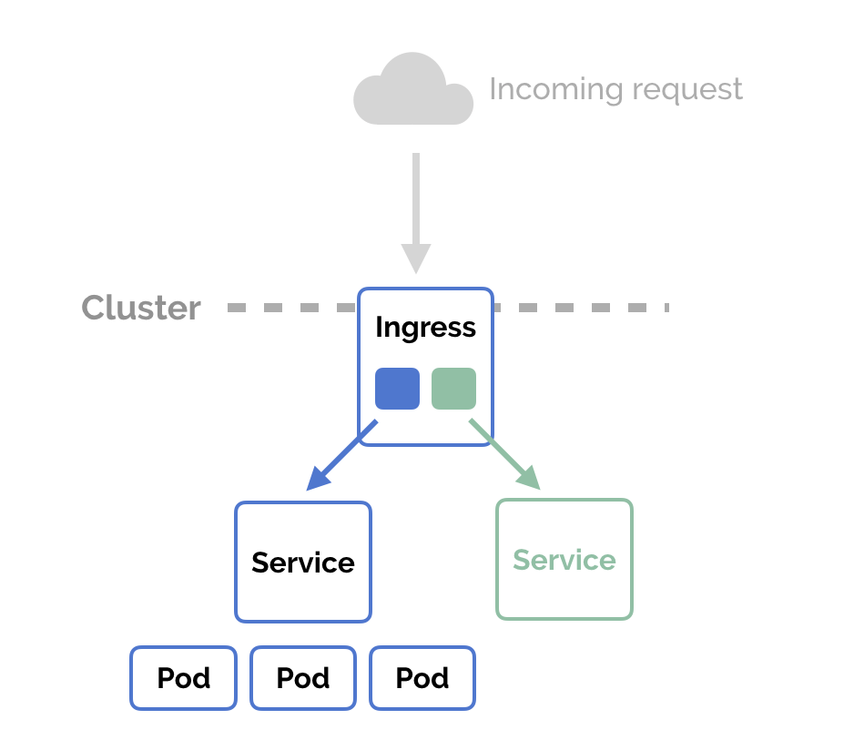

# 💾 Kubernetes Storage — Complete Guide (Volumes, PV, PVC, StorageClass)

---

## 🧩 Why We Need Storage in Kubernetes

Pods in Kubernetes are **ephemeral** — when a Pod dies, its data is lost.  
To persist data (like logs, databases, uploads, etc.), Kubernetes provides a **storage abstraction layer**.

# 1️⃣ Volumes

A **Volume** in Kubernetes is a storage directory accessible to containers in a Pod.

👉 It’s mounted inside the Pod and **lives as long as the Pod lives** (unless backed by external storage).

### ✅ Common Volume Types

| Type | Description |
|------|--------------|
| `emptyDir` | Temporary storage — deleted when Pod is deleted |
| `hostPath` | Mounts a directory from the host node |
| `nfs` | Mounts NFS (Network File System) storage |
| `configMap` / `secret` | Mounts configuration data or secrets |
| `persistentVolumeClaim` | Attaches external storage via a PVC |

### 🧠 Example: `emptyDir` Volume

```yaml
apiVersion: v1
kind: Pod
metadata:
  name: volume-demo
spec:
  containers:
  - name: app
    image: busybox
    command: ["sh", "-c", "echo Hello > /data/hello.txt && sleep 3600"]
    volumeMounts:
    - name: temp-storage
      mountPath: /data
  volumes:
  - name: temp-storage
    emptyDir: {}
```
🗒️ Here /data is temporary storage that will vanish when the Pod is deleted.


# 2️⃣ Persistent Volume (PV)
A PersistentVolume (PV) is a cluster-wide storage resource — it’s an actual piece of storage in the cluster (like EBS, NFS, or local disk).
- Created by admins (or automatically via StorageClass).
- Exists independent of Pods.
- Has its own lifecycle and capacity.

## 🧠 Example: Static PV
```yaml
apiVersion: v1
kind: PersistentVolume
metadata:
  name: my-pv
spec:
  capacity:
    storage: 1Gi
  accessModes:
    - ReadWriteOnce
  persistentVolumeReclaimPolicy: Retain
  storageClassName: manual
  hostPath:
    path: /mnt/data
```

| Field                           | Description                                                    |
| ------------------------------- | -------------------------------------------------------------- |
| `capacity`                      | How much space (e.g., 1Gi)                                     |
| `accessModes`                   | RWO (single node), ROX (read-only many), RWX (read-write many) |
| `persistentVolumeReclaimPolicy` | What to do when PVC is deleted (Retain, Delete, Recycle)       |
| `storageClassName`              | Optional tag to match PVCs                                     |


# 3️⃣ Persistent Volume Claim (PVC)

- A PVC is a request for storage made by a user.
- It’s like asking Kubernetes:
`“Hey, I need 2Gi of storage with ReadWriteOnce access and standard StorageClass.”`
- Kubernetes then finds (or provisions) a matching PV.

## 🧠 Example PVC
```yaml
apiVersion: v1
kind: PersistentVolumeClaim
metadata:
  name: my-pvc
spec:
  accessModes:
    - ReadWriteOnce
  resources:
    requests:
      storage: 1Gi
  storageClassName: manual
```

# 4️⃣ StorageClass
A StorageClass defines how storage should be dynamically provisioned.
👉 It acts as a template for creating PVs automatically, usually backed by cloud storage like AWS EBS, GCP PD, or Azure Disk.

## 🧠 Example StorageClass
```yaml
apiVersion: storage.k8s.io/v1
kind: StorageClass
metadata:
  name: standard
provisioner: kubernetes.io/aws-ebs
parameters:
  type: gp2
reclaimPolicy: Delete
volumeBindingMode: Immediate
```

| Field               | Description                                                  |
| ------------------- | ------------------------------------------------------------ |
| `provisioner`       | Which plugin to use (AWS EBS, GCE PD, Ceph, etc.)            |
| `parameters`        | Storage type and config                                      |
| `reclaimPolicy`     | Delete or Retain PV after PVC deletion                       |
| `volumeBindingMode` | When volume is bound (`Immediate` or `WaitForFirstConsumer`) |

1)	Immediate – Configuring Immediate informs Kubernetes volume provisioning should be instantiated right after creation of PersistentVolumeClaim(PVC).
2)	WaitForFirstConsumer - Configuring WaitForFirstConsumer inform Kubernetes volume provisioning should be only after availability of consumer.


# 5️⃣ Static vs Dynamic Provisioning
| Type        | Description                                                             | Example                     |
| ----------- | ----------------------------------------------------------------------- | --------------------------- |
| **Static**  | Admin creates PV manually. PVC binds to existing PV.                    | Local disk, hostPath        |
| **Dynamic** | PV is created automatically when PVC requests storage via StorageClass. | AWS EBS, GCP PD, Ceph, etc. |


## 🧠 Example Workflow
🏗️ Static Provisioning:
- Admin creates PV (manual class).
- User creates PVC using same storageClassName: manual.
- PVC binds to PV.

⚙️ Dynamic Provisioning:
- PVC requests storage with a StorageClass.
- Kubernetes automatically provisions a PV.
- PVC binds automatically.


# 6️⃣ Using PVC in a Pod
Once you have a PVC, you can mount it into a Pod as a volume.
## 🧠 Example: Pod Using PVC
```yaml
apiVersion: v1
kind: Pod
metadata:
  name: pvc-demo
spec:
  containers:
  - name: app
    image: nginx
    volumeMounts:
    - name: storage
      mountPath: /usr/share/nginx/html
  volumes:
  - name: storage
    persistentVolumeClaim:
      claimName: my-pvc
```


📦 What Happens:
- Kubernetes attaches the volume defined in PVC my-pvc.
- Mounts it to /usr/share/nginx/html inside the container.
- Data stored there will persist even if the Pod is deleted.


# 7️⃣ Commands to Verify
```bash
kubectl get pv
kubectl get pvc
kubectl get sc
kubectl describe pv my-pv
kubectl describe pvc my-pvc
kubectl describe pod pvc-demo
```

# 🌐 Kubernetes Ingress

---

## 🧭 What is Ingress?

A **Kubernetes Ingress** is an **API object** that manages **external access** to services in a cluster — typically **HTTP and HTTPS** traffic.

Think of it as a **smart entry gate** to your cluster:
> Instead of exposing each Service individually via NodePort or LoadBalancer, Ingress acts as a single point of entry with intelligent routing.

---

## ⚙️ Why Ingress?
Without Ingress:
- Each Service (e.g., frontend, backend, api) needs its own **LoadBalancer** or **NodePort**.
- This leads to **costly** and **hard-to-manage** setups.



## 🧩 Ingress Architecture
Client --> Ingress Controller --> Ingress Rules --> Services --> Pods


### 🔹 Components

| Component | Description |
|------------|--------------|
| **Ingress Resource** | YAML configuration defining routing rules |
| **Ingress Controller** | The actual implementation that reads Ingress objects and configures the reverse proxy |
| **Service** | Exposes Pods internally |
| **Pod** | Runs your application |


## 🚦 How Traffic Flows

1. User hits → `https://app.example.com/api`
2. External LoadBalancer forwards traffic → Ingress Controller (e.g., NGINX)
3. Ingress Controller checks → **Ingress rules**
4. Routes request to appropriate **Service**
5. Service forwards traffic → **Pods**

---

## ⚙️ Example: Basic Ingress

### 🧱 Backend Service
```yaml
apiVersion: v1
kind: Service
metadata:
  name: web-service
spec:
  selector:
    app: web
  ports:
    - port: 80
      targetPort: 8080
```

### 🌐 Ingress Resource
```yaml
apiVersion: networking.k8s.io/v1
kind: Ingress
metadata:
  name: web-ingress
  annotations:
    nginx.ingress.kubernetes.io/rewrite-target: /
spec:
  ingressClassName: nginx
  rules:
  - host: myapp.example.com
    http:
      paths:
      - path: /
        pathType: Prefix
        backend:
          service:
            name: web-service
            port:
              number: 80
```

🧠 Explanation:
- Traffic for myapp.example.com → goes to web-service port 80.
- The NGINX Ingress Controller rewrites path / to /.


## 🧩 Types of Routing in Ingress
1️⃣ Path-Based Routing
Route based on URL path.
```yaml
rules:
- host: myapp.example.com
  http:
    paths:
    - path: /api
      pathType: Prefix
      backend:
        service:
          name: api-service
          port:
            number: 8080
    - path: /web
      pathType: Prefix
      backend:
        service:
          name: web-service
          port:
            number: 80
```

2️⃣ Host-Based Routing
Route based on domain name.
```yaml
rules:
- host: frontend.example.com
  http:
    paths:
    - path: /
      pathType: Prefix
      backend:
        service:
          name: frontend
          port:
            number: 80
- host: backend.example.com
  http:
    paths:
    - path: /
      pathType: Prefix
      backend:
        service:
          name: backend
          port:
            number: 8080
```

🔹 Requests for frontend.example.com go to frontend service
🔹 Requests for backend.example.com go to backend service

🔐 TLS (HTTPS) in Ingress
Ingress supports SSL/TLS termination — you can configure HTTPS with certificates stored in a Kubernetes Secret.
```yaml
apiVersion: networking.k8s.io/v1
kind: Ingress
metadata:
  name: secure-ingress
spec:
  tls:
  - hosts:
      - myapp.example.com
    secretName: tls-secret
  rules:
  - host: myapp.example.com
    http:
      paths:
      - path: /
        pathType: Prefix
        backend:
          service:
            name: web-service
            port:
              number: 80
```

📦 Secret Example
```yaml
apiVersion: v1
kind: Secret
metadata:
  name: tls-secret
type: kubernetes.io/tls
data:
  tls.crt: <base64-encoded-cert>
  tls.key: <base64-encoded-key>
```

## 🧠 What is Ingress Controller?
Ingress does nothing by itself — it needs an Ingress Controller to enforce rules.
Popular controllers:
  - NGINX Ingress Controller
  - HAProxy
  - Traefik
  - AWS Load Balancer Controller
  - GCE Ingress

## 🧠 Troubleshooting Tips
```bash
# List all Ingresses
kubectl get ingress

# Describe specific Ingress
kubectl describe ingress web-ingress

# Check Ingress Controller logs
kubectl logs -n ingress-nginx <nginx-pod-name>
```


# 🏷️ Annotations in Kubernetes (and Ingress)
---

## 💡 What Are Annotations?

Annotations in Kubernetes are **key-value pairs** used to attach **non-identifying metadata** to Kubernetes objects (like Pods, Deployments, Services, Ingress, etc.).

Unlike **labels**, which are used for *selection* (e.g., by ReplicaSets or Services),  
**annotations** are purely for *information, configuration, or behavior customization.*
> 💬 Think of annotations as “sticky notes” for Kubernetes objects — invisible to the scheduler, but read by controllers, operators, or third-party tools.

---

## 🧱 Example: Adding Annotations
```yaml
apiVersion: v1
kind: Pod
metadata:
  name: mypod
  annotations:
    description: "This pod runs the nginx web server"
    maintainer: "devops-team@example.com"
    backup-schedule: "daily"
spec:
  containers:
  - name: nginx
    image: nginx:latest
```
📘 Explanation:
- description, maintainer, and backup-schedule are metadata fields.
- Kubernetes doesn’t interpret them.
- They can be used by monitoring tools, scripts, or admission controllers.


## 🌐 Ingress Annotations — Behavior Customization
Ingress annotations are special metadata interpreted by the Ingress Controller (like NGINX, Traefik, AWS ALB, etc.) to modify routing behavior.
⚙️ The Ingress spec itself is generic — annotations allow controller-specific configuration.

## 🧱 Example: Ingress with NGINX Annotations
```yaml
apiVersion: networking.k8s.io/v1
kind: Ingress
metadata:
  name: myapp-ingress
  annotations:
    nginx.ingress.kubernetes.io/rewrite-target: /
    nginx.ingress.kubernetes.io/ssl-redirect: "true"
    nginx.ingress.kubernetes.io/whitelist-source-range: "192.168.0.0/16"
spec:
  ingressClassName: nginx
  rules:
  - host: myapp.example.com
    http:
      paths:
      - path: /app
        pathType: Prefix
        backend:
          service:
            name: myapp-service
            port:
              number: 80
```

📘 Explanation:
- rewrite-target: / → rewrites the incoming path /app → /
- ssl-redirect: "true" → forces HTTPS
- whitelist-source-range → restricts allowed IPs


## 🧰 How to View and Manage Annotations
```bash
# 🔍 List Annotations
kubectl get ingress myapp-ingress -o jsonpath='{.metadata.annotations}'     

# ➕ Add or Update
kubectl annotate ingress myapp-ingress nginx.ingress.kubernetes.io/rewrite-target=/api

# ➖ Remove
kubectl annotate ingress myapp-ingress nginx.ingress.kubernetes.io/rewrite-target-
```

💬 In short:
- Labels group and filter resources.
- Annotations enrich them with contextual or operational metadata.
- Ingress annotations give you “superpowers” — tweaking routing, TLS, headers, and more, without modifying code or service logic."


# 🧩 Kubernetes StatefulSets

---

## 🌟 What is a StatefulSet?

A **StatefulSet** in Kubernetes is a controller used to **manage stateful applications** — those that require **stable network identity**, **persistent storage**, and **ordered deployment/scaling**.

> 🧠 Think of a StatefulSet as a “Deployment with memory.”  
> Unlike Deployments (which create anonymous, interchangeable Pods), StatefulSets create **uniquely identifiable Pods** that **remember who they are** even after restarts.

---

## ⚙️ Key Features of StatefulSets

| Feature | Description |
|----------|-------------|
| 🆔 **Stable, unique Pod identity** | Each Pod gets a stable DNS name (`podname-0`, `podname-1`, etc.) |
| 💾 **Stable storage** | Each Pod is attached to its own PersistentVolume (PVC) that persists across restarts |
| 🕒 **Ordered, graceful deployment** | Pods are created and terminated sequentially (in index order) |
| 🔁 **Ordered rolling updates** | Ensures controlled update rollout — one Pod at a time |
| 🌐 **Stable network endpoint** | Each Pod has a consistent DNS identity via the Headless Service |

---

## 🧱 Example — Basic StatefulSet

```yaml
apiVersion: apps/v1
kind: StatefulSet
metadata:
  name: web
spec:
  serviceName: "nginx"  # Headless Service required
  replicas: 3
  selector:
    matchLabels:
      app: nginx
  template:
    metadata:
      labels:
        app: nginx
    spec:
      containers:
      - name: nginx
        image: nginx:1.25
        ports:
        - containerPort: 80
          name: web
        volumeMounts:
        - name: www
          mountPath: /usr/share/nginx/html
  volumeClaimTemplates:
  - metadata:
      name: www
    spec:
      accessModes: ["ReadWriteOnce"]
      resources:
        requests:
          storage: 1Gi
```

## 🧩 Headless Service for Stable DNS
A Headless Service (with clusterIP: None) is required for StatefulSets.
```yaml
apiVersion: v1
kind: Service
metadata:
  name: nginx
spec:
  clusterIP: None
  selector:
    app: nginx
  ports:
  - port: 80
    name: web
```

The Headless Service ensures each Pod gets its own DNS entry.
For example:
```pgsql
web-0.nginx.default.svc.cluster.local
web-1.nginx.default.svc.cluster.local
web-2.nginx.default.svc.cluster.local
```
Each Pod has a stable hostname, which is crucial for databases or clusters like Cassandra, MongoDB, or Kafka.


Each Pod gets:
- A unique name (web-0, web-1, etc.)
- A dedicated volume (www-web-0, www-web-1, etc.)
- A stable DNS endpoint through the Headless Service

## 🧭 Pod Lifecycle & Order
🧱 Creation Order:
Pods are created sequentially — from index 0 → N-1.
```text
web-0 → web-1 → web-2
```
Each Pod must become Ready before the next one starts.

🧨 Deletion Order:
When scaling down, Pods are terminated in reverse order — from highest to lowest index.
```text
web-2 → web-1 → web-0
```

## 🧩 StatefulSet vs Deployment — Quick Comparison
| Feature          | Deployment         | StatefulSet                       |
| ---------------- | ------------------ | --------------------------------- |
| Pod Identity     | Anonymous          | Stable (`podname-0`, `podname-1`) |
| Network Identity | Random             | Fixed DNS per Pod                 |
| Storage          | Shared / ephemeral | Dedicated PVC per Pod             |
| Deployment Order | Parallel           | Sequential                        |
| Scaling          | Fast & unordered   | Ordered and state-preserving      |
| Best for         | Stateless apps     | Stateful apps                     |

```text
StatefulSets are like the “memory keepers” of Kubernetes — each Pod is unique, stateful, and reliable, ensuring your data and identity persist even across restarts or updates.
```


# 🧩 Kubernetes ConfigMaps, Secrets & Environment Variables

---

## 🌟 Why We Need Them

In Kubernetes, apps often need **configuration** and **sensitive data** — API keys, DB credentials, URLs, etc.  
Instead of hardcoding these inside Pods (bad practice 🚫), Kubernetes gives us three elegant tools:

| Type | Purpose | Data Type | Security |
|------|----------|-----------|-----------|
| **ConfigMap** | Store **non-sensitive** configuration | Plain text | Not encrypted |
| **Secret** | Store **sensitive** data (passwords, keys, tokens) | Base64-encoded | More secure (can integrate with KMS or Vault) |
| **Environment Variables** | Used **inside containers** to access configuration or secrets | Key-Value pairs | Depends on source (ConfigMap/Secret) |

---

## ⚙️ 1. ConfigMaps — For Non-Sensitive Configuration

### 🧠 What is a ConfigMap?

A **ConfigMap** is a key-value store for **application configuration** data.

> Example: database hostnames, file paths, feature flags, log levels.

---

### 🧱 Creating a ConfigMap

#### Option 1️⃣ — From Literal Values

```bash
kubectl create configmap app-config \
  --from-literal=APP_MODE=production \
  --from-literal=APP_PORT=8080
```

#### Option 2️⃣ — From a File
```bash
kubectl create configmap app-config --from-file=application.properties
```

#### Option 3️⃣ — From YAML Manifest
```yaml
apiVersion: v1
kind: ConfigMap
metadata:
  name: app-config
data:
  APP_MODE: "production"
  APP_PORT: "8080"
  DB_URL: "jdbc:mysql://mysql:3306/mydb"
```

### 🧩 Using ConfigMap in Pods
(A) As Environment Variables
```yaml
apiVersion: v1
kind: Pod
metadata:
  name: app-pod
spec:
  containers:
  - name: app
    image: myapp:v1
    envFrom:
      - configMapRef:
          name: app-config
```
Now, inside the container:
```bash
echo $APP_MODE   # production
echo $DB_URL     # jdbc:mysql://mysql:3306/mydb
```

(B) As Individual Env Variables
```yaml
env:
  - name: APP_MODE
    valueFrom:
      configMapKeyRef:
        name: app-config
        key: APP_MODE
```

(C) As Mounted Files
```yaml
volumes:
- name: config-volume
  configMap:
    name: app-config
containers:
- name: app
  image: myapp:v1
  volumeMounts:
  - name: config-volume
    mountPath: /etc/config
```
Now files like /etc/config/APP_MODE and /etc/config/DB_URL are created.


## 🔐 2. Secrets — For Sensitive Information
🧠 What is a Secret?
A Secret is similar to a ConfigMap but designed for sensitive data such as:
- Passwords
- API tokens
- SSH keys
- Certificates
Secrets are Base64-encoded, not encrypted by default — but you can use encryption-at-rest or external vaults for stronger security.

### 🧱 Creating Secrets
#### Option 1️⃣ — From Literal Values
```bash
kubectl create secret generic db-secret \
  --from-literal=username=admin \
  --from-literal=password=MyP@ssw0rd
```

#### Option 2️⃣ — From a YAML Manifest
```yaml
apiVersion: v1
kind: Secret
metadata:
  name: db-secret
type: Opaque
data:
  username: YWRtaW4=         # base64 for 'admin'
  password: TXlQQHNzdzByZA== # base64 for 'MyP@ssw0rd'
```

You can generate base64 manually:
```bash
echo -n "admin" | base64
```

🧩 Using Secrets in Pods
(A) As Environment Variables
```yaml
envFrom:
  - secretRef:
      name: db-secret
```

Now you can access them in the container:
```bash
echo $username
echo $password
```

(B) As Individual Env Variables
```yaml
env:
  - name: DB_USER
    valueFrom:
      secretKeyRef:
        name: db-secret
        key: username
```

(C) As Mounted Files
```yaml
volumes:
- name: secret-volume
  secret:
    secretName: db-secret
containers:
- name: app
  image: myapp:v1
  volumeMounts:
  - name: secret-volume
    mountPath: /etc/secret
```

Now inside container:
```bash
/etc/secret/username
/etc/secret/password
```

## 🌿 3. Environment Variables in Kubernetes
Environment variables are a runtime configuration mechanism for containers.
They can be:
  - Hardcoded in Pod spec
  - Loaded from ConfigMaps or Secrets
  - Derived from Pod fields (like metadata or namespace)

### 🧱 Example — Hardcoded Env Variables
```yaml
env:
  - name: APP_MODE
    value: "production"
  - name: APP_VERSION
    value: "1.0.0"
```

### 🧩 Example — Load from Pod Metadata
```yaml
env:
  - name: POD_NAME
    valueFrom:
      fieldRef:
        fieldPath: metadata.name
  - name: POD_NAMESPACE
    valueFrom:
      fieldRef:
        fieldPath: metadata.namespace
```
🧠 Useful when your app needs to know which Pod or Namespace it’s running in.

### 🔗 Combine All Together — ConfigMap + Secret + Env
```yaml
apiVersion: v1
kind: Pod
metadata:
  name: demo-app
spec:
  containers:
  - name: app
    image: myapp:v1
    envFrom:
      - configMapRef:
          name: app-config
      - secretRef:
          name: db-secret
    env:
      - name: POD_NAME
        valueFrom:
          fieldRef:
            fieldPath: metadata.name
```

# 📦 Understanding File Updates in Mounted Volumes, ConfigMaps, and Secrets in Kubernetes
| Volume Type            | Update Source     | Live Update Reflected? | Pod Restart Needed? | Notes                           |
| ---------------------- | ----------------- | ---------------------- | ------------------- | ------------------------------- |
| `hostPath`             | Host filesystem   | ✅ Instantly            | ❌ No                | Changes visible in real time.   |
| `ConfigMap` (mounted)  | ConfigMap updated | ⏱ Within ~1 min        | ❌ No                | App must re-read file.          |
| `ConfigMap` (env vars) | ConfigMap updated | ❌ No                   | ✅ Yes               | Env vars immutable after start. |
| `Secret` (mounted)     | Secret updated    | ⏱ Within ~1 min        | ❌ No                | App must re-read file.          |
| `Secret` (env vars)    | Secret updated    | ❌ No                   | ✅ Yes               | Env vars immutable after start. |


