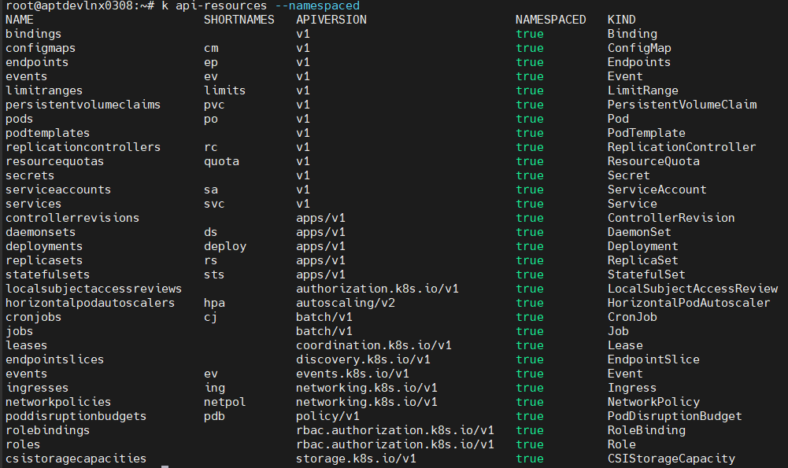
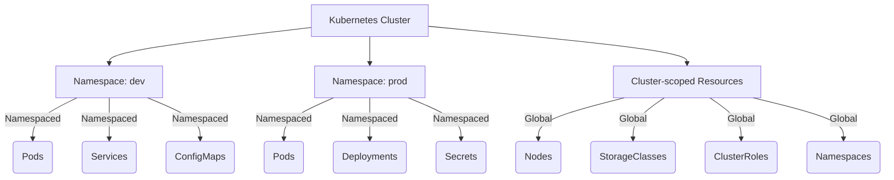
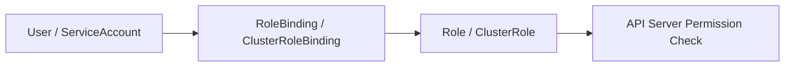

# 🧭 Namespaced vs Cluster-scoped Resources in Kubernetes
Kubernetes resources can be categorized into **two scopes**:
- **Namespaced resources**

- **Cluster-scoped (Global) resources**
### 📘 Examples
| Resource Type | Description |
|----------------|-------------|
| **Node** | Represents a cluster node (worker machine) |
| **Namespace** | Logical partition for grouping resources |
| **PersistentVolume (PV)** | Cluster-wide storage resource |
| **ClusterRole** | Defines cluster-wide permissions |
| **ClusterRoleBinding** | Grants cluster-level permissions |
| **StorageClass** | Defines how storage is provisioned cluster-wide |
| **CustomResourceDefinition (CRD)** | Defines new resource types for the entire cluster |
| **APIService** | Registers APIs to the Kubernetes API server |
| **MutatingWebhookConfiguration / ValidatingWebhookConfiguration** | Cluster-wide admission control hooks |

This distinction determines **how resources are organized**, **who can access them**, and **how they interact with each other**.

---




# 🧾 Kubernetes ServiceAccounts
## 🎯 What Is a ServiceAccount?
A **ServiceAccount (SA)** is an **identity for processes running inside a Pod** — just like how a “user account” represents a human interacting with the cluster.

So:
- **User account** → for humans (kubectl, dashboard)
- **Service account** → for apps (Pods, controllers, CI/CD, etc.)

It’s how Kubernetes knows *“which pod is making this API request?”*  
and then applies authentication + authorization (RBAC) rules accordingly.

---

## ⚙️ How It Works
When a Pod runs inside Kubernetes:
1. It is **associated with a ServiceAccount** (either explicitly or by default).
2. The **ServiceAccount’s token** (a JWT) is automatically **mounted into the Pod** at:
    `/var/run/secrets/kubernetes.io/serviceaccount/token`
3. The app inside the Pod can then call the **Kubernetes API** using this token.
Example:
```bash
curl -sSk -H "Authorization: Bearer $(cat /var/run/secrets/kubernetes.io/serviceaccount/token)" \
https://kubernetes.default.svc/api/v1/pods
```
That request is authenticated as that ServiceAccount identity.

## 🧱 Default ServiceAccount
Every namespace automatically has a default ServiceAccount named default.
If you don’t specify one when creating a Pod:
```yaml
spec:
  serviceAccountName: default
```
Then this default one is used automatically.

⚠️ Important:
- The default SA has no permissions unless you bind it to a Role or ClusterRole.
- So if your Pod tries to list Pods using the Kubernetes API, it’ll get:
```Error from server (Forbidden): pods is forbidden: User "system:serviceaccount:default:default" cannot list resource "pods"```

## 🧩 Creating Your Own ServiceAccount
```bash
kubectl create serviceaccount my-app-sa
```

This creates:
- A ServiceAccount object in the current namespace
- A secret automatically generated containing the token (in older versions)
- In newer Kubernetes versions (1.24+), tokens are ephemeral and handled by the TokenRequest API — not stored as secrets by default.

YAML Example:
```yaml
apiVersion: v1
kind: ServiceAccount
metadata:
  name: my-app-sa
  namespace: dev
```
🔐 Assigning a ServiceAccount to a Pod
```yaml
apiVersion: v1
kind: Pod
metadata:
  name: mypod
spec:
  serviceAccountName: my-app-sa
  containers:
    - name: app
      image: nginx
```
✅ Now this Pod uses my-app-sa instead of the default one.


# 🔐 Role-Based Access Control (RBAC) in Kubernetes
## 🧭 What is RBAC?
**RBAC (Role-Based Access Control)** is a **security mechanism** in Kubernetes that regulates **who can do what** within the cluster.
It defines permissions based on:
- **Who (subject)** → User, Group, or ServiceAccount  
- **What (resource)** → Pods, Deployments, ConfigMaps, etc.  
- **What actions (verbs)** → get, list, create, update, delete, patch, watch  

RBAC ensures **least privilege access** and isolates permissions across namespaces or cluster-wide.

---

## ⚙️ How RBAC Works
RBAC uses **four primary objects**:

| Object | Scope | Purpose |
|---------|--------|----------|
| **Role** | Namespaced | Defines allowed actions (verbs) on resources within a specific namespace. |
| **ClusterRole** | Cluster-scoped | Defines actions that apply cluster-wide or to non-namespaced resources. |
| **RoleBinding** | Namespaced | Grants a Role’s permissions to a user, group, or service account in a namespace. |
| **ClusterRoleBinding** | Cluster-scoped | Grants a ClusterRole’s permissions across the entire cluster. |

---

## 🔑 RBAC Flow



Steps:
1. User (or Pod’s ServiceAccount) makes an API call to the Kubernetes API Server.
2. API Server authenticates the user (via token, certificate, etc.).
3. API Server checks RBAC bindings to verify if the user is authorized.
4. If permissions match → request allowed ✅
   Else → request denied ❌ (403 Forbidden)

## 🧩 RBAC Core Objects Explained
### 🧱 1. Role (Namespaced)
Defines permissions within a namespace.
```yaml
apiVersion: rbac.authorization.k8s.io/v1
kind: Role
metadata:
  namespace: dev
  name: pod-reader
rules:
  - apiGroups: [""]          # "" = core API group (v1)
    resources: ["pods"]
    verbs: ["get", "list", "watch"]
```

## 🧩 2. RoleBinding
Binds a Role to a subject (user, group, or service account).
```yaml
apiVersion: rbac.authorization.k8s.io/v1
kind: RoleBinding
metadata:
  name: read-pods-binding
  namespace: dev
subjects:
  - kind: User
    name: abhishek        # user identity
    apiGroup: rbac.authorization.k8s.io
roleRef:
  kind: Role
  name: pod-reader        # Role being granted
  apiGroup: rbac.authorization.k8s.io
```
✅ Grants user abhishek permission to get/list/watch pods in namespace dev.

## 🧭 3. ClusterRole (Global)
Used for cluster-wide resources or shared roles.
```yaml
apiVersion: rbac.authorization.k8s.io/v1
kind: ClusterRole
metadata:
  name: cluster-admin-viewer
rules:
  - apiGroups: [""]
    resources: ["nodes", "namespaces", "pods"]
    verbs: ["get", "list", "watch"]
```

## 🌍 4. ClusterRoleBinding
Grants a ClusterRole to subjects across the entire cluster.
```yaml
apiVersion: rbac.authorization.k8s.io/v1
kind: ClusterRoleBinding
metadata:
  name: cluster-admin-viewer-binding
subjects:
  - kind: User
    name: admin
    apiGroup: rbac.authorization.k8s.io
roleRef:
  kind: ClusterRole
  name: cluster-admin-viewer
  apiGroup: rbac.authorization.k8s.io
```
✅ Grants user admin read-only access cluster-wide.

## 📚 Difference Between Role/ClusterRole and RoleBinding/ClusterRoleBinding
| Type                   | Scope        | Grants Permissions                                          | Applies To                                 |
| ---------------------- | ------------ | ----------------------------------------------------------- | ------------------------------------------ |
| **Role**               | Namespaced   | Inside a namespace                                          | Pods, Services, ConfigMaps, etc.           |
| **ClusterRole**        | Cluster-wide | Across all namespaces                                       | Nodes, PersistentVolumes, Namespaces, etc. |
| **RoleBinding**        | Namespaced   | Binds a Role or ClusterRole to subjects **in a namespace**  | User, Group, or ServiceAccount             |
| **ClusterRoleBinding** | Cluster-wide | Binds ClusterRole to subjects across the **entire cluster** | User, Group, or ServiceAccount             |


## Important Commands
```bash
# View all built-in roles:
kubectl get clusterroles

# Inspect details:
kubectl describe clusterrole view

# Check what a user/serviceaccount can do:
kubectl auth can-i get pods --as developer -n dev

# Examples:
kubectl auth can-i delete pods --as system:serviceaccount:dev:default
kubectl auth can-i list secrets --as abhishek -n dev
```

## 🧱 Real-world Example: ServiceAccount RBAC
```yaml
apiVersion: v1
kind: ServiceAccount
metadata:
  name: backend-sa
  namespace: dev
---
apiVersion: rbac.authorization.k8s.io/v1
kind: Role
metadata:
  namespace: dev
  name: configmap-reader
rules:
  - apiGroups: [""]
    resources: ["configmaps"]
    verbs: ["get", "list"]
---
apiVersion: rbac.authorization.k8s.io/v1
kind: RoleBinding
metadata:
  name: configmap-reader-binding
  namespace: dev
subjects:
  - kind: ServiceAccount
    name: backend-sa
    namespace: dev
roleRef:
  kind: Role
  name: configmap-reader
  apiGroup: rbac.authorization.k8s.io
```
✅ The Pod using backend-sa can now read ConfigMaps in the dev namespace.

| Question                                                          | Answer                                                                       |
| ----------------------------------------------------------------- | ---------------------------------------------------------------------------- |
| When no RBAC roles/bindings exist, can anyone access the cluster? | ❌ No — except `system:masters` group users (cluster admins).                 |
| Can default ServiceAccount access resources?                      | ❌ No — it has **zero permissions** until explicitly bound.                   |
| Why this design?                                                  | To follow the **Principle of Least Privilege** and ensure safety by default. |


# 🧑‍💻 Creating a User in Kubernetes

Unlike traditional systems, **Kubernetes doesn’t store user objects** inside the cluster (unlike `ServiceAccounts`).  
Instead, Kubernetes relies on **external authentication mechanisms** (like certificates, tokens, or OIDC) to verify users.

---

## 🔹 Step 1: Understanding Kubernetes Authentication

Kubernetes supports multiple authentication methods:

- **X.509 client certificates** (most common for users)
- **Bearer tokens** (for service accounts or OIDC)
- **OpenID Connect (OIDC)** (for enterprise SSO)
- **Webhook tokens**

For normal users, the easiest way is using **client certificate authentication**.

---

## 🔹 Step 2: Create a Certificate for the User

We’ll generate:
1. A private key  
2. A Certificate Signing Request (CSR)  
3. Approve it via Kubernetes  

### Example: Create a User `abhishek`

```bash
# Generate private key
openssl genrsa -out abhishek.key 2048

# Generate CSR
openssl req -new -key abhishek.key -out abhishek.csr -subj "/CN=abhishek/O=dev-team"
```
Here:
- CN → Common Name → user name (abhishek)
- O → Organization → maps to group (dev-team)

## 🔹 Step 3: Create a Kubernetes CSR Object
Encode the CSR in base64 and create the Kubernetes CSR YAML:
```bash
cat abhishek.csr | base64 | tr -d "\n"
```
Create a YAML file:
```yaml
apiVersion: certificates.k8s.io/v1
kind: CertificateSigningRequest
metadata:
  name: abhishek-csr
spec:
  groups:
  - system:authenticated
  request: <BASE64_ENCODED_CSR>
  signerName: kubernetes.io/kube-apiserver-client
  usages:
  - client auth
```
Apply it:
```bash
kubectl apply -f abhishek-csr.yaml
```

## 🔹 Step 4: Approve the CSR
An admin must approve the certificate signing request:
```bash
kubectl get csr
kubectl certificate approve abhishek-csr
```

## 🔹 Step 5: Retrieve the Signed Certificate
kubectl get csr abhishek-csr -o jsonpath='{.status.certificate}' | base64 --decode > abhishek.crt

Now you have
- abhishek.key → private key
- abhishek.crt → signed certificate

## 🔹 Step 6: Add the User to kubeconfig
```bash
kubectl config set-credentials abhishek \
  --client-certificate=abhishek.crt \
  --client-key=abhishek.key
```
Associate a context:
```bash
kubectl config set-context abhishek-context \
  --cluster=kubernetes \
  --namespace=default \
  --user=abhishek
```
Switch to this context:
```bash
kubectl config use-context abhishek-context
```

## 🔹 Step 7: Bind RBAC Roles to the User
By default, the user has no permissions after authentication.
We must assign roles or cluster roles.


# 🔐 Creating Kubernetes Users via OIDC (Keycloak / AWS IAM / Azure AD)
In production environments, users aren’t created manually using certificates.  
Instead, organizations integrate Kubernetes with an **OpenID Connect (OIDC)** provider like:

- **Keycloak**
- **AWS IAM Identity Provider**
- **Azure Active Directory**
- **Google Cloud Identity**

This allows **Single Sign-On (SSO)** and **centralized user management**.

---

## 🧩 What is OIDC?
**OIDC (OpenID Connect)** is an identity layer built on top of **OAuth 2.0**.  
It allows Kubernetes to **delegate authentication** to an external identity provider (IdP).

When you run a `kubectl` command:
1. Kubernetes redirects you to the IdP for login.
2. You authenticate (e.g., via Google, Azure, Keycloak).
3. The IdP issues a **JWT (JSON Web Token)**.
4. Kubernetes API Server verifies this token before allowing access.

## ⚙️ Step-by-Step: Granting EKS Access to an IAM User
### 1️⃣ Create an IAM User
Create an IAM user, e.g., `abhishek`, in your AWS account.
Attach permissions so that the user can assume roles (for EKS access):

```bash
aws iam create-user --user-name abhishek
aws iam attach-user-policy --user-name abhishek --policy-arn arn:aws:iam::aws:policy/IAMReadOnlyAccess
```
(You’ll normally give AdministratorAccess for testing or more fine-grained IAM policies later.) 

### 2️⃣ Update the aws-auth ConfigMap
When EKS is created, there’s a special ConfigMap in the kube-system namespace named aws-auth.
It defines who (IAM users/roles) can authenticate to the cluster and what Kubernetes groups they map to.
Get the ConfigMap:
```bash
kubectl -n kube-system get configmap aws-auth -o yaml
```
Edit it:
```bash
kubectl edit -n kube-system configmap aws-auth
```
Add a new map entry under mapUsers:
```yaml
apiVersion: v1
kind: ConfigMap
metadata:
  name: aws-auth
  namespace: kube-system
data:
  mapUsers: |
    - userarn: arn:aws:iam::123456789012:user/abhishek
      username: abhishek
      groups:
        - dev-team
```
Here:
- userarn → Full ARN of the IAM user
- username → Appears as user in Kubernetes (kubectl output)
- groups → Maps to Kubernetes RBAC groups (e.g., dev-team)
Save and exit.


### 3️⃣ Add RBAC Rules for the User/Group
Define what the user can do via Kubernetes RBAC.
Example: allow users in group dev-team to view Pods in all namespaces.
```yaml
apiVersion: rbac.authorization.k8s.io/v1
kind: ClusterRoleBinding
metadata:
  name: dev-team-view
subjects:
- kind: Group
  name: dev-team
  apiGroup: rbac.authorization.k8s.io
roleRef:
  kind: ClusterRole
  name: view
  apiGroup: rbac.authorization.k8s.io
```

### 4️⃣ Configure AWS CLI and kubectl for the User
Log in as the IAM user (e.g., using AWS credentials for abhishek):
```bash
aws configure
# enter access key and secret key of user abhishek
```
Update kubeconfig for that user:
```bash
aws eks update-kubeconfig --region ap-south-1 --name dev-cluster
```
Now run:
```bash
kubectl get pods --all-namespaces
```
✅ If RBAC allows, the user will see resources. Otherwise → Error from server (Forbidden


## 🔐 How Authentication Works (Under the Hood)
- kubectl calls aws eks get-token
- AWS CLI uses IAM credentials to generate a signed token (STS)
- Token is sent to the EKS API server
- API server validates the token against AWS OIDC endpoint
- If valid → maps the IAM entity to K8s username/group via aws-auth ConfigMap
- RBAC rules decide whether the action is permitted


# ☸️ Kubernetes Custom Resource Definitions (CRDs)

## 📘 What is a CRD?
A **Custom Resource Definition (CRD)** allows you to extend the Kubernetes API by **defining your own resource types** — just like `Pods`, `Deployments`, or `Services`.
Essentially, CRDs let you create **Custom Resources (CRs)** that behave like native K8s objects, managed by controllers or operators.

---

## 🧠 Why CRDs Exist
- Kubernetes has a declarative model — everything is an API resource.
- But what if your app needs **domain-specific configuration** or **automation logic**?
- Instead of writing an external system, you can **define your own API object** and manage it **natively within Kubernetes**.

For example:
- A `Database` CRD to manage MySQL/Postgres deployments.
- A `BackupPolicy` CRD to define backup frequency.
- A `CanaryRelease` CRD to manage advanced rollout strategies.

---

## 🏗️ How CRDs Work
1. **Define a CRD** → tells Kubernetes API server about a new kind (e.g., `Database`).
2. **Create Custom Resource (CR)** → instances of that CRD (e.g., `mydb.yaml`).
3. **Controller/Operator** watches CR changes → reconciles cluster state accordingly.

---

## ⚙️ CRD Example

Let’s define a CRD for managing simple database instances.

### Step 1️⃣: Define CRD (YAML)
```yaml
apiVersion: apiextensions.k8s.io/v1
kind: CustomResourceDefinition
metadata:
  name: databases.mycompany.com
spec:
  group: mycompany.com
  versions:
    - name: v1
      served: true
      storage: true
      schema:
        openAPIV3Schema:
          type: object
          properties:
            spec:
              type: object
              properties:
                dbName:
                  type: string
                storageSize:
                  type: string
                replicas:
                  type: integer
  scope: Namespaced
  names:
    plural: databases
    singular: database
    kind: Database
    shortNames:
      - db
```

👉 After applying the above file it creates a new API endpoint:
`/apis/mycompany.com/v1/namespaces/<ns>/databases`

### Step 2️⃣: Create a Custom Resource (CR)
Now define and apply an actual database object using the above CRD:
```yaml
apiVersion: mycompany.com/v1
kind: Database
metadata:
  name: prod-db
spec:
  dbName: users
  storageSize: 10Gi
  replicas: 2
```

🧩 What Happens Internally
- The API Server now recognizes Database as a valid kind.
- The CRD acts as the schema.
- Each CR instance (like prod-db) is stored in etcd.
- If you have a controller/operator running, it will:
  - Watch these CRs.
  - Take actions (e.g., deploy StatefulSets, manage PVCs, etc.).
  - Reconcile cluster state automatically.

🧩 CRD = API Extension,
🧠 Operator = Automation Layer on top of CRD.

### 🔐 CRD RBAC Example
To control access to CRDs:
```yaml
apiVersion: rbac.authorization.k8s.io/v1
kind: Role
metadata:
  name: db-admin
rules:
- apiGroups: ["mycompany.com"]
  resources: ["databases"]
  verbs: ["get", "list", "create", "update", "delete"]
```


# 🧠 Kubernetes Operators — Extending Kubernetes the Smart Way

## 📘 What is an Operator?

A **Kubernetes Operator** is a **custom controller** that uses **Custom Resource Definitions (CRDs)** to manage the lifecycle of complex applications or infrastructure — *in a Kubernetes-native way.*

It automates what a **human operator** would do manually:
- Deploying
- Configuring
- Monitoring
- Upgrading
- Healing (self-recovery)
- Backups and restores

> 💡 Think of an Operator as “an application-specific controller that encodes domain knowledge.”

---

## 🧩 Operator = CRD + Controller

| Component | Description |
|------------|--------------|
| **CRD (Custom Resource Definition)** | Defines new Kubernetes API object types (e.g., `Database`, `RedisCluster`, `KafkaTopic`). |
| **Controller** | The logic that watches those CR objects and reconciles their desired and actual state. |

Together → they form an **Operator**.

---

## ⚙️ How It Works
1. You define a **CRD** → tells Kubernetes about your new resource type (`Database`, `BackupPolicy`, etc.)
2. You deploy a **controller (Operator)** → runs inside the cluster, continuously watching the CRs.
3. When you create or update a **Custom Resource (CR)**:
   - The Operator detects the change via the API server.
   - It executes logic (e.g., create Deployment, PVC, Service, etc.) to match the desired state.
4. Operator keeps reconciling until the desired = actual state ✅

---

## 🔁 Reconciliation Loop
Every Operator runs a **reconciliation loop** — a continuous watch → compare → act cycle.

```yaml
while true:
    desired_state = get_custom_resource()
    actual_state = observe_cluster()
    if desired_state != actual_state:
        make_changes()
```
This is the same pattern used by built-in controllers like: Deployment Controller etc.

## 🧱 Operator Lifecycle Phases
Operators bring DevOps intelligence inside Kubernetes.
| Phase              | What Happens                      |
| ------------------ | --------------------------------- |
| **Installation**   | Deploy Operator YAML/Helm/OLM     |
| **Watching**       | Operator watches CRDs it owns     |
| **Reconciliation** | Detects drift, applies logic      |
| **Status Update**  | Updates `.status` in CR           |
| **Self-Healing**   | Restores desired state if broken  |
| **Upgrade**        | Handles schema or version changes |

## 🧠 Operator Types (by Implementation)
| Type                       | Description                                         | Example                |
| -------------------------- | --------------------------------------------------- | ---------------------- |
| **Go-based Operator**      | Full control logic written in Go using Kubebuilder. | Prometheus Operator    |
| **Helm-based Operator**    | Reuses Helm charts for reconciliation.              | Nginx Ingress Operator |
| **Ansible-based Operator** | Uses Ansible playbooks for CR actions.              | Logging Operator       |
| **Python-based Operator**  | Uses `kopf` for Pythonic logic.                     | Custom backup operator |


# 🚀 Kubernetes Cluster Upgrade Guide (Step-by-Step)

Upgrading a Kubernetes cluster is all about **keeping API server, control-plane, and node components in sync** — while minimizing downtime.

---

## 🧭 1️⃣ Pre-Upgrade Checks

Before touching anything, verify the cluster state:

```bash
kubectl get nodes
kubectl get pods -A
kubectl cluster-info
```

Check the current versions:
```bash
kubectl version --short
kubeadm version
```

✅ Ensure:
- All nodes are Ready
- All Pods are Running
- ETCD and control-plane are healthy
- Backup taken (etcd + manifests)

## 💾 2️⃣ Backup etcd & Cluster State
Etcd stores your cluster’s entire state — always back it up before upgrading!
```bash
ETCDCTL_API=3 etcdctl snapshot save /opt/etcd-backup/snapshot.db \
--endpoints=https://127.0.0.1:2379 \
--cacert=/etc/kubernetes/pki/etcd/ca.crt \
--cert=/etc/kubernetes/pki/etcd/server.crt \
--key=/etc/kubernetes/pki/etcd/server.key
```

Also, back up manifests:
```bash
cp -r /etc/kubernetes/manifests /opt/manifests-backup/
```

## 🧩 3️⃣ Drain the Control Plane Node
Safely evict workloads before upgrade:
```bash
kubectl drain <control-plane-node> --ignore-daemonsets --delete-emptydir-data
```

## ⚙️ 4️⃣ Upgrade kubeadm Tooling
On the control plane node:
```bash
apt-mark unhold kubeadm && \
apt-get update && \
apt-get install -y kubeadm=1.31.0 && \
apt-mark hold kubeadm
```
Check what upgrade versions are available:
```bash
kubeadm upgrade plan
```

## 🧱 5️⃣ Apply the Upgrade to Control Plane
```bash
sudo kubeadm upgrade apply v1.31.0
```
This command:
- Upgrades control plane components (API Server, Controller Manager, Scheduler)
- Upgrades etcd (if bundled)
- Updates cluster configuration in /etc/kubernetes/
Verify:
```bash
kubectl get componentstatuses
kubectl version
```

## 🧰 6️⃣ Upgrade kubelet and kubectl
Still on the same node:
```bash
apt-mark unhold kubelet kubectl && \
apt-get install -y kubelet=<target-version> kubectl=<target-version> && \
apt-mark hold kubelet kubectl
```

Restart kubelet:
```bash
sudo systemctl daemon-reload
sudo systemctl restart kubelet
```
Uncordon node:
```bash
kubectl uncordon <control-plane-node>
```

## 🧮 7️⃣ Upgrade Worker Nodes
Repeat for each worker node:
```bash
kubectl drain <worker-node> --ignore-daemonsets --delete-emptydir-data
```
On the node:
```bash
apt-get update && \
apt-get install -y kubeadm=<target-version> && \
kubeadm upgrade node
apt-get install -y kubelet=<target-version> kubectl=<target-version>
systemctl daemon-reload
systemctl restart kubelet

# finally
kubectl uncordon <worker-node>
```

## ☁️ 8️⃣ AWS EKS Upgrade Flow
If using Amazon EKS, the control plane is managed — so:
  - You only upgrade worker node AMIs.
  - EKS console/CLI handles control-plane upgrade.

Example:
```bash
aws eks update-cluster-version --name my-cluster --kubernetes-version 1.31
```
Then, update worker node groups:
```bash
aws eks update-nodegroup-version --cluster-name my-cluster --nodegroup-name my-ng --launch-template-version 3
```


## 💥 9️⃣ Certificate Expiry During Upgrade
If certificates (like API Server or etcd) are expired, renew them before or during upgrade.
Auto-renew (kubeadm)
```bash
sudo kubeadm certs renew all
sudo systemctl restart kubelet
```

Manual verification
```bash
sudo kubeadm certs check-expiration
```
Certificates live under `/etc/kubernetes/pki/`.

## 💡 Tip: Always upgrade one minor version at a time, e.g., v1.29 → v1.30 → v1.31 (never skip versions).

## 🧠 In short:
Upgrading Kubernetes = upgrade control plane → kubelet → worker nodes → verify → celebrate 🎉


## cordon vs drain vs uncordon
| Command      | Affects Scheduling?                | Evicts Pods? | Typical Use Case                  |
| ------------ | ---------------------------------- | ------------ | --------------------------------- |
| **cordon**   | ✅ Stops new pods from scheduling   | ❌ No         | Temporarily prevent new workloads |
| **drain**    | ✅ Stops new pods + evicts existing | ✅ Yes        | Maintenance or upgrade            |
| **uncordon** | ✅ new pods can be scheduled again      | ❌ No         | Bring node back after maintenance |


