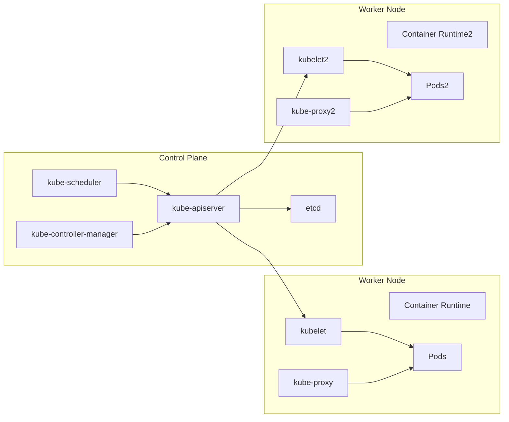

# ☸️ Kubernetes Notes

---

## 🚀 Why Kubernetes?

### 🧩 The Problem Before Kubernetes
Before Kubernetes (a.k.a. K8s), deploying and managing containerized applications at scale was **painful**:

| Challenge | Description |
|------------|--------------|
| **Manual Deployment** | You had to manually start containers on each host. |
| **Scaling Issues** | Scaling up/down required manual container orchestration. |
| **Downtime** | If a container or node crashed, services went down. |
| **Networking Hell** | Managing communication between containers and hosts was complex. |
| **Load Balancing** | No built-in mechanism to distribute traffic among containers. |
| **Resource Management** | Containers could fight for CPU/RAM — no isolation or limits. |

---

### 💡 Kubernetes to the Rescue
Kubernetes (by Google, now CNCF) automates deployment, scaling, and management of containerized applications.

| Feature | What It Does |
|----------|---------------|
| **Container Orchestration** | Manages container lifecycle — deploy, start, stop, restart. |
| **Self-Healing** | Restarts failed containers automatically. |
| **Load Balancing & Service Discovery** | Distributes traffic evenly across healthy pods. |
| **Horizontal Scaling** | Scales pods up/down automatically based on resource usage. |
| **Rolling Updates & Rollbacks** | Updates apps with zero downtime. |
| **Declarative Configuration** | You describe the desired state — Kubernetes makes it real. |
| **Secret & Config Management** | Securely manages environment variables, config, and credentials. |

> 🧠 Think of Kubernetes as the **"operating system for your containers"** — it abstracts away servers and lets you focus on apps.

---

## 🏗️ Kubernetes Architecture Overview

### 🎯 Core Idea
Kubernetes follows a **Master–Worker (Control Plane–Node)** architecture.

---

### 🧠 Control Plane Components (Master Node)
The **Control Plane** manages the cluster — it makes global decisions like scheduling, scaling, and maintaining the desired state.

| Component | Role |
|------------|------|
| **kube-apiserver** | The **entry point** for all commands (kubectl, UI, API calls). Exposes REST APIs for cluster communication. |
| **etcd** | The **key-value database** that stores the cluster’s state and configuration. (Think of it as Kubernetes’ brain 🧠). |
| **kube-scheduler** | Decides **which node** a new pod should run on based on CPU, memory, affinity, taints, etc. |
| **kube-controller-manager** | Runs various **controllers** (like replication, node, endpoint, etc.) that maintain cluster health. |
| **cloud-controller-manager** | Integrates Kubernetes with cloud providers (e.g., AWS, GCP, Azure) for load balancers, volumes, etc. |

> Example: You declare 3 replicas of your app. The controller ensures exactly 3 pods are always running — not more, not less.

---

### ⚙️ Worker Node Components
Worker nodes actually **run your application workloads** (pods, containers).

| Component | Role |
|------------|------|
| **kubelet** | Agent running on each node. Talks to the API server and ensures containers are running as per PodSpec. |
| **kube-proxy** | Manages **networking** for pods — handles routing and load balancing inside the cluster. |
| **Container Runtime** | Responsible for running containers (e.g., containerd, CRI-O, Docker). |

> 🧠 kubelet = caretaker of the node.  
> kube-proxy = network traffic manager.

---

### 🔗 How They Talk (Cluster Flow)

