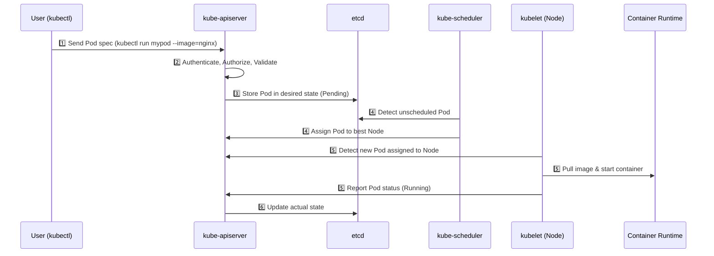

# ☸️ Kubernetes Notes

---

## 🚀 Why Kubernetes?

### 🧩 The Problem Before Kubernetes
Before Kubernetes (a.k.a. K8s), deploying and managing containerized applications at scale was **painful**:

| Challenge | Description |
|------------|--------------|
| **Manual Deployment** | You had to manually start containers on each host. |
| **Scaling Issues** | Scaling up/down required manual container orchestration. |
| **Downtime** | If a container or node crashed, services went down. |
| **Networking Hell** | Managing communication between containers and hosts was complex. |
| **Load Balancing** | No built-in mechanism to distribute traffic among containers. |
| **Resource Management** | Containers could fight for CPU/RAM — no isolation or limits. |

---

### 💡 Kubernetes to the Rescue
Kubernetes (by Google, now CNCF) automates deployment, scaling, and management of containerized applications.

| Feature | What It Does |
|----------|---------------|
| **Container Orchestration** | Manages container lifecycle — deploy, start, stop, restart. |
| **Self-Healing** | Restarts failed containers automatically. |
| **Load Balancing & Service Discovery** | Distributes traffic evenly across healthy pods. |
| **Horizontal Scaling** | Scales pods up/down automatically based on resource usage. |
| **Rolling Updates & Rollbacks** | Updates apps with zero downtime. |
| **Declarative Configuration** | You describe the desired state — Kubernetes makes it real. |
| **Secret & Config Management** | Securely manages environment variables, config, and credentials. |

> 🧠 Think of Kubernetes as the **"operating system for your containers"** — it abstracts away servers and lets you focus on apps.

---

## 🏗️ Kubernetes Architecture Overview

### 🎯 Core Idea
Kubernetes follows a **Master–Worker (Control Plane–Node)** architecture.

---

### 🧠 Control Plane Components (Master Node)
The **Control Plane** manages the cluster — it makes global decisions like scheduling, scaling, and maintaining the desired state.

| Component | Role |
|------------|------|
| **kube-apiserver** | The **entry point** for all commands (kubectl, UI, API calls). Exposes REST APIs for cluster communication. |
| **etcd** | The **key-value database** that stores the cluster’s state and configuration. (Think of it as Kubernetes’ brain 🧠). |
| **kube-scheduler** | Decides **which node** a new pod should run on based on CPU, memory, affinity, taints, etc. |
| **kube-controller-manager** | Runs various **controllers** (like replication, node, endpoint, etc.) that maintain cluster health. |
| **cloud-controller-manager** | Integrates Kubernetes with cloud providers (e.g., AWS, GCP, Azure) for load balancers, volumes, etc. |

> Example: You declare 3 replicas of your app. The controller ensures exactly 3 pods are always running — not more, not less.

---

### ⚙️ Worker Node Components
Worker nodes actually **run your application workloads** (pods, containers).

| Component | Role |
|------------|------|
| **kubelet** | Agent running on each node. Talks to the API server and ensures containers are running as per PodSpec. |
| **kube-proxy** | Manages **networking** for pods — handles routing and load balancing inside the cluster. |
| **Container Runtime** | Responsible for running containers (e.g., containerd, CRI-O, Docker). |

> 🧠 kubelet = caretaker of the node.  
> kube-proxy = network traffic manager.

---

### 🔗 How They Talk (Cluster Flow)


# 🧠 What Happens When You Run `kubectl run mypod --image=nginx`
---
## ⚙️ Step-by-Step Internal Flow
### 🟢 1. kubectl Command
- You run:
  ```bash
  kubectl run mypod --image=nginx
  ```
- The kubectl CLI parses your command and constructs a Pod manifest (YAML) on your behalf.
- It then sends a REST API request to the kube-apiserver, typically over HTTPS.

### 🧩 2. API Server (Authentication & Validation)
The kube-apiserver is the entry point for all cluster operations.
It performs:
- **Authentication**: Verifies your identity (e.g., via certificate, token, or kubeconfig context).
- **Authorization**: Checks your access permissions (e.g., via RBAC rules).
- **Admission Control**: Runs admission webhooks or policies that can mutate or deny the request.
- **Schema Validation**: Ensures the Pod manifest follows the correct Kubernetes API spec.
✅ If all checks pass → the request is accepted.

### 💾 3. Persisting to etcd
The API server writes the validated Pod object into etcd, which is Kubernetes’ distributed key-value store holding the cluster’s desired state.
At this point, the Pod exists — but it’s in the Pending state because no node has been assigned yet.


### 🧮 4. Scheduling the Pod
- The kube-scheduler continuously watches the API server (via etcd) for unscheduled Pods.
- When it finds the new Pod:
    - It evaluates all available nodes based on:
        - Resource availability (CPU, memory)
        - Node selectors, affinity/anti-affinity rules
        - Taints and tolerations
        - Pod priorities and topology constraints
    - It selects the most suitable node and updates the Pod’s spec.nodeName field in etcd.
- The Pod now transitions from Pending → Scheduled.

### 🖥️ 5. Kubelet on the Assigned Node
- The kubelet (agent running on every node) watches the API server for Pods scheduled to its node.
- Once it detects the new Pod:
    1. It retrieves the Pod specification.
    2. Pulls the container image (nginx in this case) from the container registry (e.g., Docker Hub), if not already cached.
    3. Creates the Pod and its container(s) via the container runtime (e.g., containerd, CRI-O, or Docker).
    4. Monitors the container, ensuring it stays in the Running and healthy state.
    5. Reports Pod status back to the API server.

### 🧑‍🔧 6. Controller Manager
- The kube-controller-manager runs multiple background controllers that continuously reconcile the desired state (from etcd) with the actual state (from the cluster).
- If a Pod crashes or a node fails, the relevant controller ensures a new Pod is created to restore the desired state.

### 🔁 7. Continuous Reconciliation
- Kubernetes operates on the principle of declarative desired state:
**You declare what you want; Kubernetes ensures how it happens.**
- Controllers, scheduler, and kubelets all work together in a continuous feedback loop to maintain:
    - Pod health
    - Correct node assignments
    - Replica counts
    - Desired configurations

### 🧭 TL;DR (Summary Flow)



