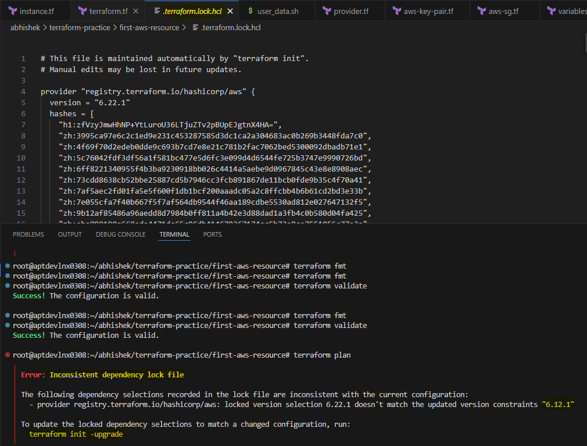
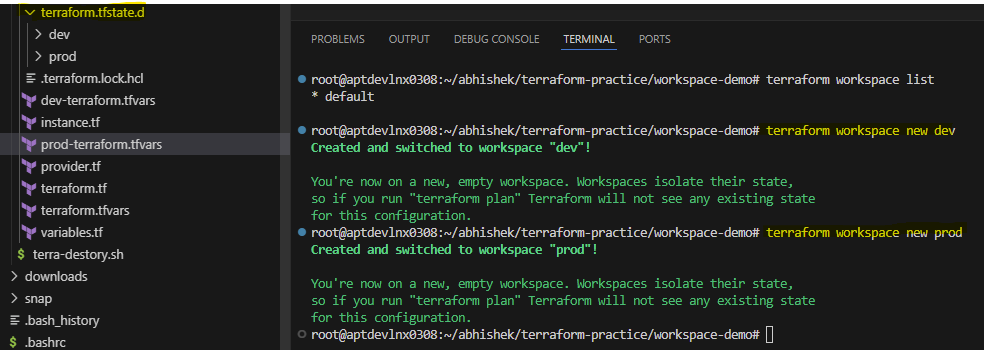

terraform basics notes link -> https://www.zero2devops.com/blog/ultimate-guide-to-terraform


--- 

# Terraform Provider Versions & Lock File

## Terraform Init and Provider Download

When we run the `terraform init` command, Terraform downloads the provider versions mentioned in the configuration.  
At the same time, Terraform generates a **dependency lock file** (`.terraform.lock.hcl`), which stores the exact provider versions used.

Example:
- Running `terraform init` downloads:
  - **aws provider version: 6.22.1**

If we later update our configuration to require version **6.12.1** and run:
```sh
terraform plan
```
We can see below error -



This mechanism ensures **consistent provider versions** across the entire team.

---

## Terraform Block Example

```hcl
terraform {
  required_version = "> 1.12.0"

  required_providers {
    aws = {
      source  = "hashicorp/aws"
      version = "6.22.1"
    }
  }
}
```

---

# Terraform Plan, Refresh, and State Behavior

## What Happens When You Run `terraform plan`?
When you execute:
```sh 
terraform plan
```

Terraform performs **two major actions**:

### 1. Refresh the State
Terraform compares:
- The **state file** (Terraform’s view of infrastructure)  
**vs**
- The **actual infrastructure** in the cloud
This was previously done by `terraform refresh` (now deprecated).

### 2. Create the Execution Plan
Terraform determines what actions are required to reach the desired state defined in the `.tf` files.

### Summary
```terraform plan = refresh + diff/plan```

---

## Replacement for `terraform refresh` (Deprecated)
Instead of `terraform refresh`, use:
### **1. Refresh Only (without applying changes)**
```sh
terraform plan -refresh-only
```
- Updates the plan with refreshed values  
- **Does NOT update the Terraform state file**

### **2. Skip Refresh**
```sh
terraform plan -refresh=false
```
- Skips checking real infrastructure  
- Uses only the existing state file  

## Behavior Comparison

| Command | What It Does | Updates tfstate? |
|---------|---------------|-------------------|
| `terraform plan --refresh-only` | Shows what a refresh would change | ❌ No |
| `terraform apply --refresh-only` | Performs the refresh and updates the state | ✅ Yes |
| `terraform refresh` (deprecated) | Used to update state | ⚠️ Deprecated |

---

## Important Notes About Refresh

### 1. Refresh does **not** change real infrastructure
- It only updates **Terraform’s state file** to reflect what already exists.

### 2. Terraform is a declarative tool
- Manual changes made directly in the cloud are treated as **drift**.
- A refresh **only reports** that drift by updating the state file.
- On the next `terraform apply`, Terraform will:
  - Compare state to desired configuration
  - **Correct the drift** by enforcing what is written in the `.tf` code

### Example
If someone manually changes an EC2 tag or deletes a resource:
- Refresh updates the state file to reflect those changes.
- Next `terraform apply` will recreate or fix the resource to match the Terraform code.

---


# Terraform Lifecycle Block

## Example Lifecycle Block

```hcl
resource "aws_instance" "web" {
  ami           = "ami-123"
  instance_type = "t2.micro"

  lifecycle {
    create_before_destroy = true
    prevent_destroy       = true
    ignore_changes        = [ tags ]
  }
}
```

The lifecycle block controls how Terraform manages changes, ordering, and behavior when updating or destroying resources.

1. create_before_destroy
Ensures the new resource is created first, and only after that the old resource is destroyed.
When to use:
 - You want zero downtime
 - A resource must always exist (blue/green pattern)
 - Replacements must not break dependencies
```hcl
 lifecycle {
  create_before_destroy = true
}
```

2. prevent_destroy
Prevents accidental deletion of critical resources.
```hcl
lifecycle {
  prevent_destroy = true
}
```
If someone runs:
```sh
terraform destroy
```
Terraform will throw an error:
```sh
Resource ... has prevent_destroy set, so it cannot be destroyed
```

3. ignore_changes
Instructs Terraform to ignore specific attributes even if they drift from the configuration.
Example
``hcl
lifecycle {
  ignore_changes = [ instance_type ]
}
```
If someone manually changes the instance type in AWS:
- Terraform will not try to revert the change
- terraform plan will not show a diff

Useful when:
- AWS auto-manages certain attributes
  (e.g., desired_capacity of Auto Scaling Group)
- External processes update fields (scripts, console changes)
- You intentionally allow manual updates

4. replace_triggered_by (Newer Terraform Feature)
Forces a resource to be recreated when another resource or specific attribute changes.
Example
```hcl
lifecycle {
  replace_triggered_by = [ aws_security_group.web ]
}
```

Meaning:
If security group changes, the EC2 instance is recreated.


--- 

# ⚙️ How to Manually Unlock?
If Terraform crashes during apply:
```sh
terraform force-unlock <LOCK_ID>
```

--- 


# Terraform Workspaces

Terraform workspaces allow you to maintain **separate state files** for different environments (such as dev, staging, prod) while using the **same Terraform configuration**.

---

## Using Different Variable Files

Assume we have the following variable files:

- `terraform.tfvars`
- `dev-terraform.tfvars`
- `prod-terraform.tfvars`

### Default Behavior

```sh
terraform apply
```
Terraform automatically loads ```terraform.tfvars``` by default.

Using a specific tfvars file
```sh
terraform apply -var-file=dev-terraform.tfvars
```
This applies configuration with variables from dev-terraform.tfvars.

### The Problem Without Workspaces
If you run apply with different variable files (dev, prod, etc.):
- The same state file is used (terraform.tfstate)
- State gets overridden
- Resources from one environment affect the other

This is dangerous because:
- Dev apply can override Prod state
- Destroy in one environment may impact another
- No isolation between environments

### Solution — Terraform Workspaces
Workspaces allow:
- Multiple environments
- Separate state files
- Clean environment separation

Workflow Example
Let's say we have two environments:
- dev
- prod

We will create two workspaces:
```sh
terraform workspace new dev
terraform workspace new prod
```

How it Works Internally
When you create a workspace, Terraform generates a directory named:
```sh
terraform.tfstate.d/
```


Inside it, Terraform stores separate state files per workspace:
```sh
terraform.tfstate.d/dev/terraform.tfstate
terraform.tfstate.d/prod/terraform.tfstate
```

Result
- Each environment keeps its own state
- No conflicts
- Same code, different state

---

# Terraform Import — What, Why, When, and How

## What Is `terraform import`?

`terraform import` is a Terraform command that allows you to bring an **existing real-world cloud resource** (EC2 instance, S3 bucket, VPC, security group, etc.) under Terraform management **without recreating it**.

Terraform import connects:

- The **Terraform state file**  
- With an **existing infrastructure resource**

### Important Notes

- `terraform import` **only updates the Terraform state file**.
- It **does NOT generate Terraform configuration** automatically.
- You must write the corresponding `.tf` resource block manually.

---

## How to Use Terraform Import (Step-by-Step)

### **Step 1: Write the Resource Block in Terraform**

Example: Importing an AWS Security Group

```hcl
resource "aws_security_group" "web_sg" {
  name = "my-web-sg"
}
```
The resource block must exist before running the import command.

### **Step 2: Run the Import Command**
Syntax:
```sh
terraform import <resource_address> <resource_id>
```

Example:
```sh
terraform import aws_security_group.web_sg sg-0abc123ef456
```

### **Step 3: Run terraform plan**
Terraform will display differences between:
- What exists in real AWS
- What is defined in your Terraform code

You must update your .tf files so they match the actual attributes of the imported resource.

### **Step 4: Adjust Terraform Code Until Both Match**
Continue updating the .tf configuration until:
```sh
terraform plan
```
shows:
```sh
No changes. Infrastructure is up-to-date.
```
Only at this point is Terraform safely managing the imported resource.

