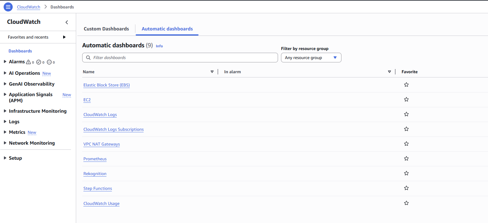
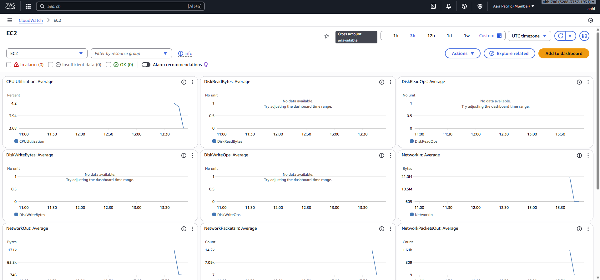
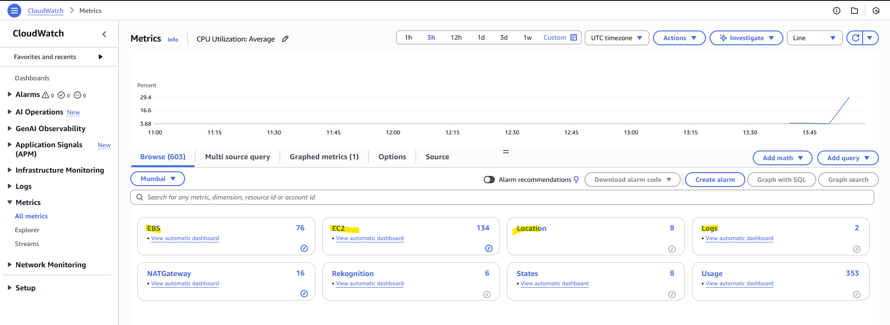
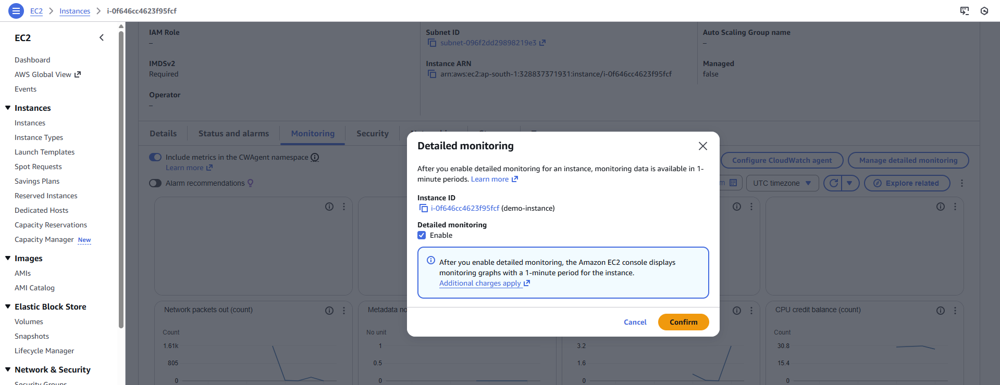
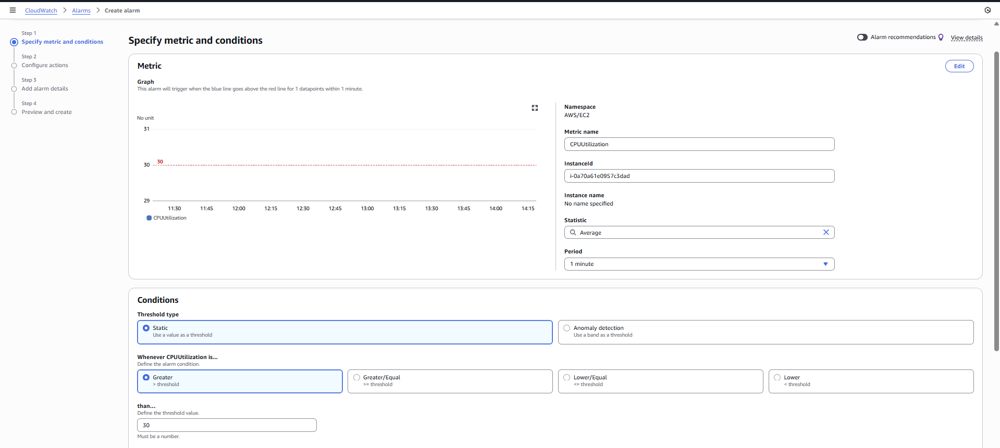
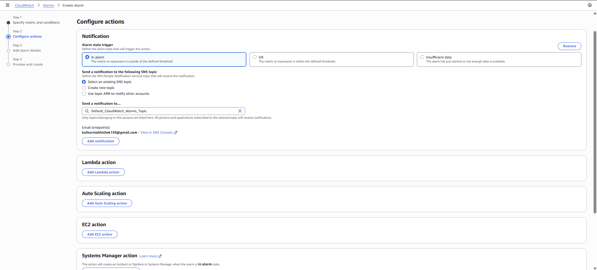

# 📡 AWS CloudWatch 
---
## 🟦 What is Amazon CloudWatch?
Amazon CloudWatch is a fully-managed monitoring and observability service provided by AWS.
It collects and visualizes metrics, logs, events, and traces from AWS services, applications, and on-premise systems.

🔍 CloudWatch helps you:
- Monitor the performance and health of AWS resources
- Collect logs and build dashboards
- Detect operational issues and trigger alarms
- Automatically respond using SNS, Lambda, Auto Scaling, SSM, etc.
- Gain insights for cost optimization, troubleshooting, and security

## 🟨 What Are CloudWatch Automatic Dashboards?
Automatic Dashboards are pre-built dashboards in CloudWatch that are auto-generated for your AWS resources.

👉 CloudWatch automatically creates them without any manual effort.
✔ What They Show:
- EC2 CPU, network, disk metrics
- RDS CPU, storage, IOPS
- Lambda invocations, errors, duration
- API Gateway latency, 4xx/5xx errors
- DynamoDB read/write capacity, throttles






## 📊 Amazon CloudWatch Metrics & Namespaces
🟦 What Are CloudWatch Metrics?

CloudWatch metrics are time-ordered data points that represent the performance of AWS resources or applications.
Metrics are the foundation of CloudWatch monitoring—everything (dashboards, alarms, logs) is built on top of metrics.

✔ Characteristics of Metrics:
- Stored for 15 months
- Collected at 1-minute granularity (standard)
- Some support 1-second or 5-second high-resolution metrics
- Can be AWS-generated (built-in) or Custom Metrics
- Can be queried using CloudWatch Metrics, Metric Math, or CloudWatch Dashboards


🗂 CloudWatch Namespaces
A namespace is a container/group for related CloudWatch metrics.
AWS services push their metrics to service-specific namespaces.


We can create our own custom metrics and namespaces as well.

If we want to monitor the data with less time gap (default is 5 minutes) then we can enable detailed monitoring -



## Create alarm in cloud watch -
let's create an alarm for CPU utilization. If CPU utilization is greater than 30% then trigger the alarm.
 

we can perform different actions in case alarm triggers -
 
for now, let's create SNS topic with email and select the same to get email notification.

- We can perform various actions when the alarm is triggered like lambda function call, auto scaling action etc.
- We can create Billing alarm as well using cloudwatch.
- We can create composite alarms as well. (by combining two or more alarms)


## Cloudwatch Agent
- By default we will not get all the required metrics for EC2 instanes. Let's say we want the metrics for the memory usage or swap memory usage or our application logs. 
- To get all such details we need to install and configure Cloudwatch Agent n our ec2 instance.


## 📂 Amazon CloudWatch Log Groups
🟦 What Are CloudWatch Log Groups?
A CloudWatch Log Group is a container that holds and organizes multiple Log Streams.
It acts as a top-level folder for logs generated by AWS services, applications, or servers.

Think of it as:
Log Group = Folder
Log Stream = File inside the folder


## 📊 Amazon CloudWatch Logs Insights
📌 What is CloudWatch Logs Insights?
CloudWatch Logs Insights is a fully managed, interactive log analytics service that lets you search, query, and visualize logs stored in CloudWatch Log Groups.

### Query Language
Logs Insights uses its own line-oriented query language similar to SQL.
You run queries against one or more log groups.

Basic structure:
```sql
fields @timestamp, @message
| filter @message like /ERROR/
| sort @timestamp desc
| limit 20
```

Example:
Search for ERROR logs
```sql
fields @timestamp, @message
| filter @message like /ERROR/
| sort @timestamp desc
| limit 20
```

---


# AWS Lambda
## What is Serverless?
- Serverless is a cloud execution model where you run code **without provisioning or managing servers**.
- The cloud provider (AWS) automatically:
  - Allocates compute resources
  - Scales up and down
  - Handles fault tolerance
  - Manages patching and infrastructure
- You are charged only for:
  - Number of requests
  - Execution time (duration)
- No need to think about:
  - Instances
  - Operating systems
  - Scaling groups
  - Capacity planning

In short:  
**Serverless = No servers to manage + automatic scaling + pay only for usage.**

## What is event driven?
- Event-driven architecture means your code runs **in response to events**.
- An *event* can be anything that triggers execution, such as:
  - S3 object upload  
  - API Gateway HTTP request  
  - SNS message  
  - SQS queue event  
  - CloudWatch schedule (cron)  
  - DynamoDB stream update  
  - EventBridge event  
- Lambda automatically executes your function whenever the associated event occurs.

In short:  
**Event-driven = Functions run only when an event triggers them.**


## Simple lambda function:
## Simple Lambda Function (Python Example)

```python
def lambda_handler(event, context):
    return "Hello from Lambda!"
```

Key points:
- event → Input data sent to Lambda (JSON)
- context → Metadata such as function name, memory, timeout, request ID
- Must return a JSON-serializable response

## How to pass input parameteres to lambda function?
- Lambda only accepts input through the event parameter.
- The structure of event depends on the trigger source.
- For custom inputs, you can pass any JSON object.

Lambda receives inputs via the event object, depending on the trigger.
Manually (Test event in console):
Example input:
```json
{
  "name": "John",
  "age": 30
}
```

Lambda:
```python
def lambda_handler(event, context):
    print(event["name"])
    print(event["age"])
    return event
```

## Lambda Function URL
### What is a Lambda Function URL?
- A **Lambda Function URL** is a dedicated HTTPS endpoint that allows you to invoke a Lambda function directly **without** needing API Gateway.
- It provides a simple, built-in way to call Lambda functions over HTTP.
- Introduced by AWS as a lightweight alternative to API Gateway for simple webhooks, callbacks, and direct integrations.

---

# AWS Lambda – Hot Start vs Cold Start

## 🔥 What is a Hot Start?
A **Hot Start** occurs when Lambda reuses an already-initialized execution environment from a previous invocation.

### How it works:
- Lambda keeps execution environments **warm** for a short period.
- When another request arrives, AWS reuses:
  - The same runtime
  - The same initialized code
  - The same network connections (if reused)
- No initialization delay.

## ❄️ What is a Cold Start?
A **Cold Start** occurs when AWS must create a new Lambda execution environment **from scratch**.

### Steps involved in a Cold Start:
1. **Download the code package**  
2. **Create a new container**  
3. **Initialize the runtime** (Python, Node.js, Java, etc.)  
4. **Run the initialization phase** (`init` section or global scopes)  
5. Finally run the **lambda_handler**

Because of these steps → cold starts introduce noticeable latency.


## 🧠 Why Cold Starts Happen
Cold starts occur when:
- First ever execution of your Lambda
- Function hasn’t been called recently

**Note** - AWS does NOT provide any guaranteed or documented time for how long a Lambda execution environment stays warm.


