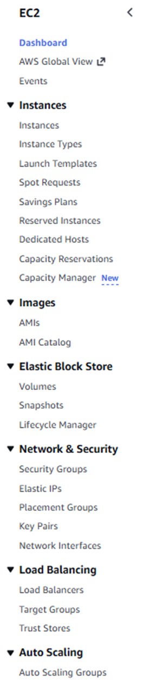

# EC2 (Region scoped)
All below points are important for EC2 -

| Category                 | Details / Fields                               | Notes                                                   |
|--------------------------|-------------------------------------------------|---------------------------------------------------------|
| **General Instance Info** | Name                                           | User-defined identifier for instance                    |
|                          | AMI (Amazon Linux, Ubuntu, etc.)               | Defines OS, pre-installed apps, configuration           |
|                          | Instance Type (t2.micro, t3.micro, etc.)       | Defines CPU, RAM, network performance                   |
|                          | Key Pair                                       | Private key used for SSH connection                     |
| **Network Configuration** | VPC                                            | Logical network environment                             |
|                          | Subnet                                         | Sub-network (AZ-specific) within VPC                    |
|                          | Security Group                                 | Virtual firewall controlling inbound/outbound rules     |
|                          | Allow Traffic                                  | Common rules: SSH (22), HTTP (80), HTTPS (443)         |
| **Storage**              | Root Volume                                    | Default EBS volume attached to instance                 |
|                          | Additional Volumes                              | Optional EBS volumes for extra storage                  |
| **Lifecycle**            | Create → Connect → Manage                      | Full process flow while dealing with instances          |

## EC2 Lifecycle
- EC2 instance lifecycle states:
  - pending → running → stopping → stopped → terminating → terminated

## On-Demand Instances
- When we launch an EC2 instance in the usual/default way, it becomes an **On-Demand Instance**.
- Characteristics:
  - Created based on immediate requirement (“on demand”)
  - Offers high flexibility
  - More expensive compared to other pricing models
- Best for:
  - Short-term workloads
  - Unpredictable traffic patterns

## Spot Instances
- Best for background, batch, or non-critical workloads.
- Works on a **capacity-based pricing model**:
  - AWS sells unused EC2 capacity at heavily discounted prices (up to **90% cheaper**).
  - If capacity becomes unavailable, AWS may terminate Spot instances with a **2-minute warning**.
- Spot instances are ideal when:
  - Workloads are fault-tolerant
  - Workloads can be interrupted
  - You want the lowest possible compute cost

## Creating a Spot Instance (Spot Fleet Request)
To create a Spot instance using a Spot Fleet Request, follow these steps:

1. Go to **EC2 Console → Spot Requests → Create Spot Fleet Request**.
2. Choose an allocation strategy (recommended: **capacityOptimized**).
3. Set **target capacity** (Spot capacity + optional On-Demand capacity).
4. Select **multiple instance types** to increase availability.
5. Configure launch settings:
   - AMI
   - Instance type
   - VPC/Subnets
   - Security Groups
   - Key Pair
   - Storage
6. Choose the IAM Fleet Role: **AWSServiceRoleForEC2SpotFleet**.
7. (Optional) Set a **maximum spot price** or leave blank for automatic pricing.
8. Choose request type:
   - **maintain** → auto-replace interrupted instances
   - **request** → one-time request
9. Add relevant tags (cost center, owner, environment).
10. Review and submit the Spot Fleet Request.

## Reserved Instances (RIs)

- Reserved Instances (RIs) are a **billing discount** available for:
  - EC2
  - RDS
  - ElastiCache
  - Redshift
  - OpenSearch
- They do **not** reserve capacity (except **Zonal RIs**).
- They reduce hourly costs when committing for:
  - 1-year term
  - 3-year term

### Why Reserved Instances?
- On-Demand instances are expensive for long-running workloads.
- RIs provide significant cost savings:
  - Up to **75% cheaper** than On-Demand pricing
- Savings depend on:
  - Term (1-year or 3-year)
  - Payment option (No Upfront, Partial Upfront, All Upfront)
  - Standard RI vs Convertible RI

### How Reserved Instances Work Internally
- RIs apply automatically to matching running instances.
- Matching criteria:
  - Instance family (e.g., t3)
  - Instance size (e.g., t3.medium)
  - Operating system (Linux/Windows)
  - Tenancy (Default / Dedicated)
  - Region or Availability Zone (depending on RI type)
- No changes required on EC2 — discount is automatically applied.

### Types of Reserved Instances

#### 1. Standard Reserved Instances
- Maximum cost savings (up to 75%)
- Best for predictable, steady workloads
- You can modify:
  - Availability Zone
  - Instance size
  - Network type
- Limitations:
  - Cannot change instance family (example: t3 → t4g)
- Typical use case:
  - Production workloads running 24/7

#### 2. Convertible Reserved Instances
- Can change:
  - Instance family (example: t3 → m5 → c6g)
- More flexibility compared to Standard RIs
- Savings up to 54%
- Limitation:
  - Lower discount than Standard RIs
- Typical use case:
  - When the instance type may change over time

### Zonal RI vs Regional RI
- **Zonal RI**:
  - Tied to a specific Availability Zone
  - Provides capacity reservation
- **Regional RI**:
  - Applies at region level
  - No capacity reservation

### Payment Options for Reserved Instances
- **All Upfront**
  - Highest discount
  - Pay 100% at the start
- **Partial Upfront**
  - Medium discount
  - Pay some upfront, rest monthly
- **No Upfront**
  - Lowest discount
  - Pay monthly with commitment only

## Savings Plans

- Savings Plans provide flexible pricing with up to **72%** savings.
- You commit to a consistent hourly spend for:
  - 1 year
  - 3 years
- Unlike RIs, Savings Plans are **not tied to a specific instance type**.
- You commit to a fixed spend (example: ₹50/hour), and AWS applies discounts automatically.

### When to Use Savings Plans
- Use Savings Plans when:
  - Workloads run 24/7
  - Architecture may change (e.g., moving to Fargate or Lambda)
  - You are unsure about long-term instance types
  - You want flexibility along with cost optimization

### Savings Plans vs Reserved Instances (Summary)
- **Flexibility**:
  - Savings Plans: High
  - Reserved Instances: Low–Medium
- **Applies To**:
  - Savings Plans: EC2, Lambda, Fargate
  - RIs: Mostly EC2, RDS, etc.
- **Savings**:
  - Savings Plans: Up to ~66%
  - RIs: Up to ~75%
- **Capacity Reservation**:
  - Savings Plans: No
  - RIs: Yes (Zonal RI)
- **Instance Binding**:
  - Savings Plans: No
  - RIs: Yes (Standard RI)

## When to Use Spot vs On-Demand vs Reserved vs Savings Plans

### On-Demand Instances
- Use when:
  - Workloads are unpredictable or short-term
- Savings: Least
- Interruption Tolerance: No interruptions acceptable

### Spot Instances
- Use when:
  - Workloads are fault-tolerant and flexible
- Savings: Highest (up to 90%)
- Interruption Tolerance: Can be interrupted

### Reserved Instances
- Use when:
  - Predictable workloads running 24/7
- Savings: Maximum (up to 75%)
- Interruption Tolerance: No interruptions; fixed setup

### Savings Plans
- Use when:
  - You need flexibility across instance types/services
- Savings: High (~66%)
- Interruption Tolerance: No interruptions

## Instance Types
What: Combinations of CPU, memory, storage and networking (e.g., t3, m6i, c6g, r5) tuned for different workloads.
Families
  - General purpose: t3, m5, m6i
  - Compute optimized: c5, c6g
  - Memory optimized: r5, x1
  - Storage optimized: i3 (NVMe)
  - Accelerated: p3, g4 (GPU), inf1 (inference)
